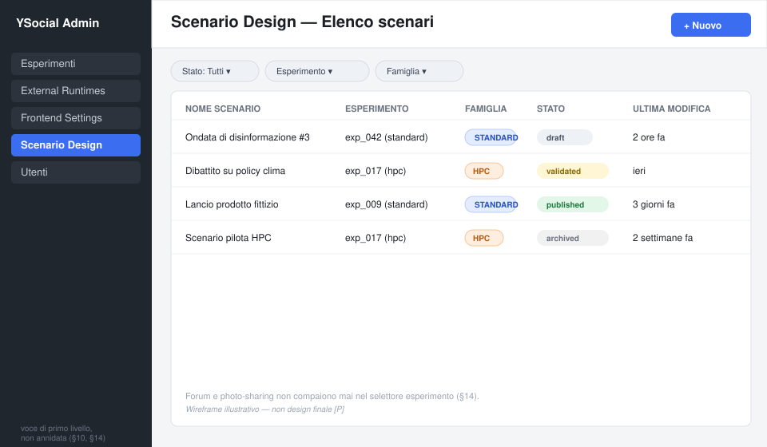
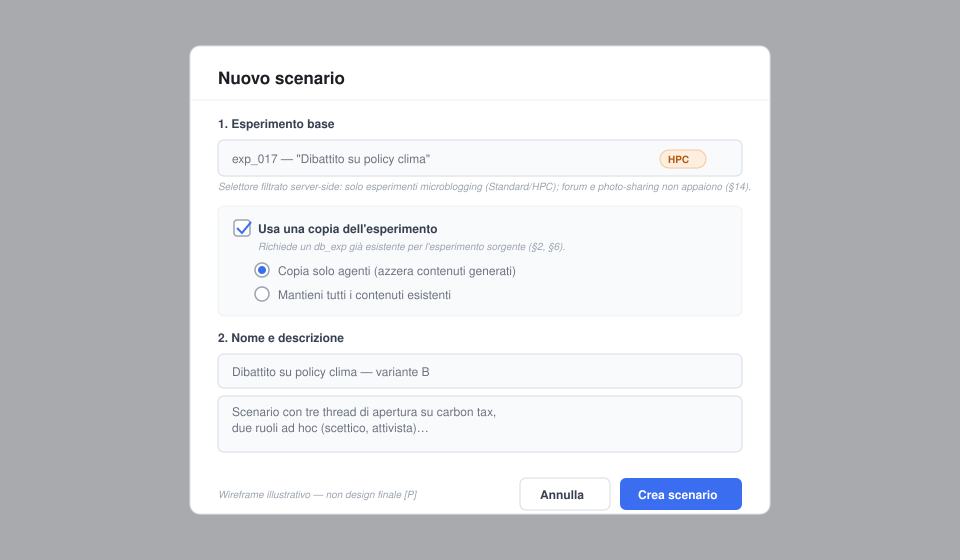
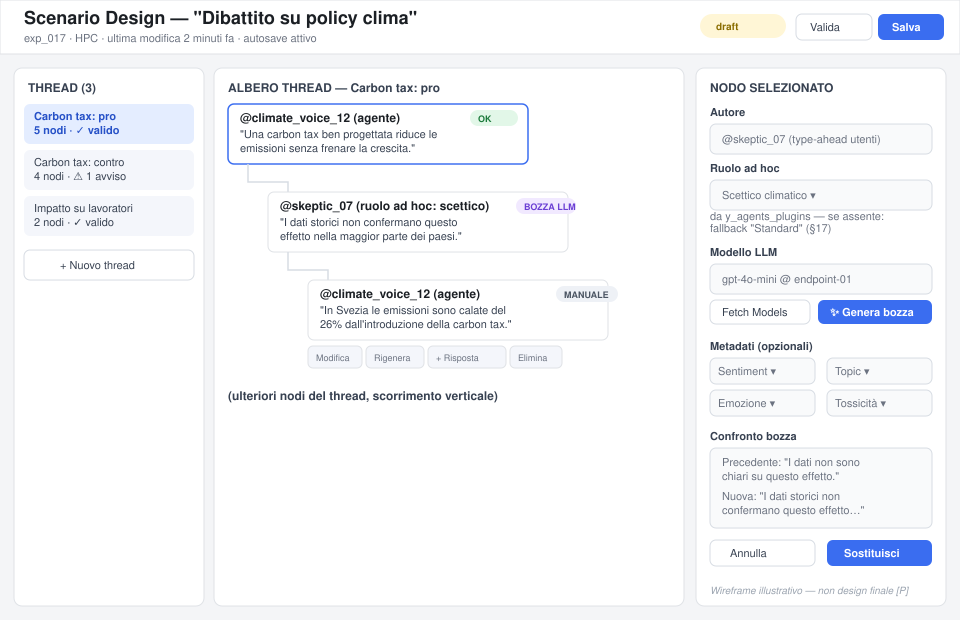
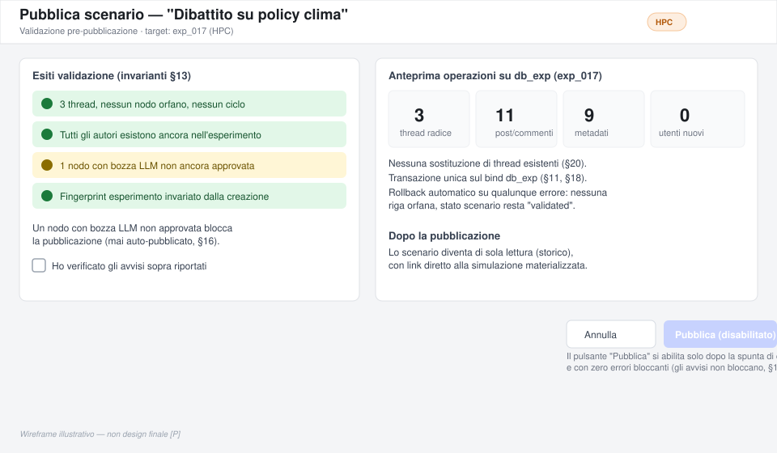

# Scenario Design — Piano Tecnico di Implementazione (Plugin esterno YSocial)

> Documento di pianificazione. Nessun codice è stato scritto, nessun file del repository è stato modificato, nessun commit è stato creato. Legenda usata nel testo: **[F]** fatto verificato nel codice, **[P]** proposta progettuale, **[A]** assunzione da confermare, **[D]** domanda aperta per il product owner.

---

## 1. Sintesi della soluzione proposta

Scenario Design va realizzato come **nuova suite di plugin frontend esterna**, distribuita in un repository dedicato (`ScenarioDesign` o nome equivalente, vedi §9), seguendo **esattamente** il pattern già usato da `frontend_adds-on` e da `reactive_agents` **[F]**: repo registrato in `SUPPORTED_EXTERNAL_REPOS` con `group="frontend_plugins"`, manifest a due livelli (`meta/info.json` + `meta/registry.json` con blocco `suite` e lista `frontend_plugins`), blueprint Flask importato dinamicamente via lo spazio dei nomi sintetico di `plugin_loader.py`, asset statici serviti dalla route generica `/plugins/<repo_key>/<module_id>/static/<filename>`, voce di menu condizionata alla presenza+validità del plugin, migrazioni JIT per-esperimento via `ensure_module_schema`.

Non è necessario alcun hook *nuovo* per "aggiungere sezioni admin": il meccanismo generico esiste già (blueprint + voce di sidebar condizionale, vedi §8). Servono invece due estensioni *generiche e minime* al core, non specifiche di Scenario Design:
1. un piccolo endpoint di "esperimenti eleggibili per famiglia" riusabile da qualunque plugin (oggi ogni consumer reimplementa i propri filtri `platform_type`/`simulator_type`, vedi §8.2);
2. nessun'altra modifica strutturale è strettamente necessaria — CRUD di post/thread, bozze, LLM, pubblicazione vivono interamente nel plugin, leggendo/scrivendo sul `db_exp` dell'esperimento tramite i modelli SQLAlchemy già esposti da `y_web.src.models.experiment` e, per i propri dati di bozza, in tabelle proprie.

Il perimetro v1 è **solo** microblogging standard + microblogging HPC. **[F, verificato]** Le due famiglie condividono lo stesso *concetto* di schema (post/commenti in un'unica tabella `post`, `comment_to`/`thread_id` per la gerarchia) ma **non lo stesso schema fisico**: Standard usa chiavi `INTEGER` autoincrement, HPC (runtime `YSimulator`) usa chiavi `VARCHAR(36)` (UUID stringa) ovunque, inclusi `user_mgmt.id`, `post.id`, `post.comment_to`, `post.thread_id`, `post.round`, `post.shared_from`. Questo impone **due adapter di materializzazione distinti** (§18, §19) dietro un'interfaccia comune, non un'unica funzione con `if hpc`.

La bozza di scenario vive in tabelle proprie del plugin (prefisso `sd_`), **nel `db_exp` dell'esperimento a cui lo scenario è associato** — non nel `db_admin` e non in JSON versionati (motivazione in §11; decisione **[Risolto dal product owner]**, conseguenza diretta del vincolo per cui Scenario Design opera solo su esperimenti con un `db_exp` già esistente, §2/§6). La pubblicazione resta comunque un'operazione transazionale a sé stante, separata dalle tabelle di bozza: scrive nelle tabelle "reali" (`post`, `user_mgmt`, ecc.) dello stesso `db_exp` solo al momento esplicito di "Pubblica", mai prima.

## 2. Stato attuale rilevato nel repository

Fatti verificati direttamente nel codice (percorsi assoluti nel repository `YWeb`):

- **Registro plugin esterni** — `y_web/src/external_runtime/registry.py`: dataclass `ExternalRuntimeSpec` e dict `SUPPORTED_EXTERNAL_REPOS` con 9 voci oggi: `microblogging_client/server` (YClient/YServer), `forum_client/server` (YClientReddit/YServerReddit), `hpc_simulator` (YSimulator), `photo_sharing` (YPhotoSharing), `agent_plugins` (y_agents_plugins), `reactive_agents`, `frontend_adds_on`. Ogni voce ha `group`, `category`, `path` (sotto `external/<Nome>`), `repo_url`, `install_commands`, `validate_entrypoints/import`, `is_private`, `visible_to_usernames`.
- **Gestione operazioni** — `y_web/src/external_runtime/manager.py`: install da release GitHub (`download_runtime_release`, estrazione zip/tar senza richiedere `git`) o da `git clone` (`clone_runtime_repo`, richiede `git` sull'host); `fetch_runtime_repo`/`update_runtime_repo` solo per installazioni git-managed; `install_runtime_dependencies` (usa sempre `resolve_python_executable()`, l'interprete che sta eseguendo `y_social.py`); `validate_runtime_repo` (verifica file richiesti + tentativo di `import`); `delete_runtime_repo`; log strutturato JSON-lines in `logs/external_runtime_operations.log` via `log_external_runtime_action`/`read_external_runtime_logs`.
- **Route admin** — `y_web/routes/admin/sub/experiments/_external_runtimes.py`: unica route `/admin/external_runtimes` (GET) + `/admin/external_runtimes/<repo_key>/<action>` (POST, azioni in whitelist `_MUTATING_ACTIONS`) + `/admin/external_runtimes/<repo_key>/logs`. Le azioni mutanti sono **bloccate** se esistono esperimenti attivi (`running==1` o `exp_status=="active"`) appartenenti allo stesso *group* del plugin (`_runtime_group_active_experiments`), con l'eccezione esplicita di `agent_plugins` e `frontend_plugins`, mai bloccati perché non legati a un singolo esperimento in esecuzione.
- **Pattern "suite frontend"** — `y_web/src/external_runtime/frontend_plugins.py` + `y_web/src/external_runtime/plugin_loader.py`: questo è il meccanismo che ispira direttamente l'implementazione di Scenario Design, ma **non** è quello che Scenario Design deve usare tal quale (vedi nota sotto). `discover_frontend_modules`/`validate_frontend_suite` leggono `meta/registry.json` *a runtime*, mai da cache DB. `register_frontend_plugin_suites(app)` (chiamata una sola volta da `create_app()`) importa il blueprint di ogni modulo valido tramite un modulo-namespace sintetico registrato in `sys.modules` (evita di sporcare `sys.path` e collisioni fra pacchetti `modules.*` di suite diverse), registra una route statica con protezione path-traversal, e fallisce in modo isolato per modulo (`try/except` per modulo, mai per l'intera suite). `ensure_module_schema(repo_key, module_id, exp_id)` esegue la migrazione JIT del modulo sul DB dell'esperimento, invocata dal gestore "abilita modulo per esperimento" **prima** di flippare `enabled=True`. `active_modules_context(exp_id)` è il *singolo punto di raccolta* usato dai template per sapere quali moduli iniettare lato frontend (0 overhead se nessuna suite installata). `get_hidden_user_ids` mostra il pattern di **hook generico opzionale dichiarato nel manifest** (`"visibility_filter": "<dotted.module>:<func>"`), risolto via import dinamico, mai hardcoded sul nome di una suite — è il precedente diretto per qualunque hook generico che Scenario Design voglia esporre in futuro.

  **Nota [Risolto dal product owner, uniformato in tutto il documento]**: questo meccanismo (`group="frontend_plugins"`) è specifico per widget rivolti ai *partecipanti* dell'esperimento, abilitati/disabilitati per singolo esperimento dal pannello `/admin/frontend_settings` (`post_annotation`, `responsive_agents` iniettano JS/CSS nelle pagine feed/thread che gli utenti vedono). Scenario Design è invece uno **strumento di authoring per soli amministratori**, concettualmente più vicino a `External Runtimes`/`Frontend Settings` stesse (pagine admin autonome, sempre visibili se installate e valide) che a un modulo *dentro* Frontend Settings. Va quindi registrato in una categoria funzionale **distinta** ("backend", non "frontend"), **sempre attivo quando installato e valido** (nessun toggle per-esperimento, nessuna tabella di tipo `FrontendAddsOnExpModuleSettings`), e **non deve comparire nell'elenco di `/admin/frontend_settings`**. Il dettaglio di questa categorizzazione e del meccanismo di caricamento analogo-ma-distinto è in §7, §8.2 e §10.
- **Esempio di suite reale con due moduli manifest** — `external/frontend_adds-on/meta/registry.json` (modulo `post_annotation`, parametri tipizzati `bool/int/float/enum/string_list/multiline_string`) e `external/reactive_agents/meta/registry.json` (modulo `responsive_agents`, che introduce **già** la coppia di tipi parametro `llm_endpoint_host`/`llm_endpoint_model` con `pairs_with`, e il campo manifest `visibility_filter`). Questi due manifest sono il miglior riferimento concreto per lo schema del manifest di Scenario Design.
- **Catalogo agenti ad hoc (ruoli)** — `external/y_agents_plugins/meta/registry.json`: schema **diverso** da quello delle suite frontend (niente `suite`/`frontend_plugins`, bensì `agent_types`: lista di `{agent_type, display_name, llm_required, prompt_templates, description, parameter_sections/parameters, client_parameter_sections/client_parameters}`). Il consumer lato core è `_adhoc_agent_specs()` in `y_web/routes/admin/sub/clients/_crud.py` (riferimento citato anche nel docstring di `frontend_plugins.py` come precedente di "lettura live del manifest, mai cache DB"). Scenario Design **non deve duplicare** questo catalogo: deve leggere lo stesso `meta/registry.json` live, usando solo il sottoinsieme di campi che gli serve (`agent_type`, `display_name`, `description`, eventualmente `prompt_templates` come base per il prompt LLM), con fallback silenzioso al solo ruolo "standard" se il repo non è installato/valido.
- **Modelli esperimento** — `y_web/src/models/experiment.py`: tutte le classi hanno `__bind_key__ = "db_exp"`. `Post` (id Integer PK, `tweet`, `round` Integer, `user_id` FK `user_mgmt.id`, `comment_to` Integer default `-1`, `thread_id` Integer, `news_id`, `image_id`, `image_post_id`, `dedupe_key`, `client_action_id`, `created_at`, `shared_from` Integer default `-1`, `reaction_count`, `moderated`, `is_moderation_comment`). Post e commenti **condividono la stessa tabella** `post` in Standard: un commento è un `Post` con `comment_to != -1`. Tabelle satellite confermate: `Hashtags`/`Post_hashtags`, `Emotions`/`Post_emotions`, `Mentions`, `Post_topics`, `Post_Sentiment`, `Post_Toxicity`, `Agent_Opinion`, `Reactions`, `Reported`, `Images`/`ImagePosts`, `Articles`/`Websites`/`Article_topics`, `Rounds`, `Follow`, `SysMessage`, `ReplyInboxState`, `ForumChatSession/Message` (questi ultimi due per il forum, fuori scope).
- **Schema fisico HPC — divergenza confermata** — `external/YSimulator/scripts/postgresql_server.sql` e `external/YSimulator/YSimulator/YServer/schema_migrations.py`: **tutte** le chiavi primarie ed esterne della tabella `post`/`user_mgmt`/`rounds`/ecc. sono `VARCHAR(36)` (UUID stringa), non `INTEGER` autoincrement. `post.comment_to` e `post.thread_id` sono quindi stringhe UUID in HPC contro interi in Standard. Esiste un indice dedicato `idx_post_thread_id`. Le migrazioni di schema per HPC (es. `sys_messages` con colonna `duration`) sono gestite da uno script Python proprio di `YSimulator`, indipendente dalle migrazioni di YWeb in `y_web/db_init/` e `y_web/migrations/`. **Conclusione operativa**: un adapter di materializzazione HPC non può riusare l'adapter Standard cambiando solo il tipo di sessione DB; deve generare/gestire identificatori UUID e scrivere con un dialetto di schema diverso.
- **Binding dinamico del DB esperimento** — `y_web/src/experiment/context.py`: `register_experiment_database(app, exp_id, db_name)` registra un bind Flask-SQLAlchemy per-esperimento (`db_exp_{exp_id}`) e chiama `ensure_experiment_schema_for_uri`; `_activate_db_exp_bind(exp_id)` **rimappa a runtime** l'engine condiviso `db.engines["db_exp"]` (perché Flask-SQLAlchemy 3.x cache gli engine e non rilegge `SQLALCHEMY_BINDS` automaticamente). Questo conferma l'indizio del prompt: il bind `db_exp` **è impostato per route contenenti `exp_id`**, ma tramite un meccanismo esplicito di attivazione (verosimilmente un `before_request`/decoratore nelle route esistenti), non "magicamente" per qualunque funzione. Scenario Design deve richiamare lo stesso meccanismo quando opera sul DB di un esperimento, non assumere che il bind sia già attivo.
- **Copia esperimento** — `y_web/routes/admin/sub/experiments/_crud.py`, funzione `_create_single_experiment_copy` (riga ~5013): copia la cartella `experiments/<uid>` (esclude log, `*.state.json`); **rileva se la sorgente è HPC** tramite la presenza di `server_config.json` nella cartella sorgente (criterio di fatto usato dal codice, oltre a `simulator_type`); per esperimenti Standard copia e popola `database_server.db` dal clean-schema `data_schema/database_clean_server.db` (SQLite) o applica `data_schema/postgre_server.sql` (PostgreSQL) **senza copiare i dati** dell'esperimento sorgente; per esperimenti HPC **non crea alcun database** — sarà il server HPC a crearlo al primo avvio. **Verificato puntualmente**: lo schema "pulito" `database_clean_server.db` contiene **una sola riga in `user_mgmt`** (il solo utente admin) e **zero righe in `post`** — quindi il meccanismo di copia del core oggi non porta con sé **né i post/commenti né la popolazione di agenti** dell'esperimento sorgente, solo la configurazione (file client/server JSON) che permetterebbe di rigenerarla da zero al prossimo avvio del client. Questo significa: **"crea una copia dell'esperimento" oggi produce un'istanza gemella realmente vuota**, non un clone "con gli stessi agenti".

  **Requisito per Scenario Design [Risolto dal product owner, §6]**: questo comportamento del core **non è sufficiente da solo** per il caso d'uso reale — l'admin vuole costruire uno scenario a partire da un esperimento (o da una sua copia) che **ha già la popolazione di agenti caricata** nel proprio `db_exp`, sia esso Standard o HPC, perché gli autori dei thread in bozza vengono scelti fra quella popolazione (§14, ricerca/selezione autore). L'opzione "crea e usa una copia dell'esperimento" di Scenario Design **estende** il meccanismo esistente, non si limita a richiamarlo: dopo aver invocato `_create_single_experiment_copy` (che resta responsabile di cartella, porta, config e creazione dello scheletro di DB), il plugin esegue un passo aggiuntivo, di sua proprietà, con **due modalità esplicite scelte dall'admin al momento della copia**:
  - **"Solo agenti"**: copia le sole righe `user_mgmt` (e le tabelle direttamente necessarie a renderle coerenti, es. `interests`/`user_interest` se popolate), azzerando/escludendo tutte le tabelle di contenuto generate dagli agenti nella simulazione originaria (`post` e i suoi satelliti: hashtag, menzioni, opinioni, sentiment, tossicità, reazioni, segnalazioni) — la copia risultante ha la stessa popolazione ma è vuota di contenuti.
  - **"Mantieni tutto"**: copia sia `user_mgmt` sia l'intero contenuto esistente (`post` e tutti i satelliti elencati sopra), producendo un clone realmente completo dell'esperimento sorgente.

  Precondizione comune a entrambe le modalità: è richiesto che il `db_exp` sorgente **esista già** (un esperimento HPC mai avviato non ha popolazione né contenuti da copiare, perché il suo database non esiste ancora — vedi §19); questo vincolo risolve a monte anche l'ambiguità "copiare solo esperimenti con database disponibile". Per Standard entrambe le modalità sono un bulk-copy di righe con rimappatura degli `id` interi autoincrement (stessa logica di mapping `tmp_id → id` già prevista per la pubblicazione, §18); per HPC vanno implementate tenendo conto degli identificatori `VARCHAR(36)` (§19). Questo passo è un'operazione del plugin, eseguita subito dopo la copia-configurazione del core; va validato con un test dedicato (§24) che verifichi, per entrambe le modalità e per entrambe le famiglie, la corrispondenza 1:1 degli agenti e — solo per "mantieni tutto" — anche dei contenuti fra sorgente e copia.
- **Criterio canonico famiglia esperimento** — confermato in `_external_runtimes.py::_runtime_group_active_experiments` e nel modello `Exps` (`y_web/src/models/admin.py`): i campi canonici sono **`Exps.platform_type`** (`"microblogging" | "forum" | "photo_sharing"`) e **`Exps.simulator_type`** (`"Standard" | "HPC"`). La combinazione `platform_type == "microblogging"` è l'intersezione corretta per "microblogging standard o HPC" (con `simulator_type` a distinguere le due sotto-famiglie); fotosharing usa sempre `simulator_type == "HPC"` secondo la logica di creazione esperimento (righe ~1940-1946 di `_crud.py`), quindi **non basta `simulator_type == "HPC"` da solo** per isolare "microblogging HPC": serve sempre la coppia `(platform_type == "microblogging") AND (simulator_type == "HPC")`. Questo è esattamente il "criterio fragile" da evitare se usato da solo, e conferma l'indicazione del committente di non affidarsi a nomi/cartelle.
- **Scoperta modelli LLM** — nessun tipo di parametro `llm_endpoint_model` è definito nel core Python; è un **tipo di parametro generico** riconosciuto e **renderizzato** dal template `y_web/templates/admin/frontend_settings.html` (righe ~992-1070: funzioni JS `_eduFetchModelsFor`/`_eduReadParamValue`) per *qualunque* plugin che dichiari nel manifest un parametro `llm_endpoint_host` abbinato (`pairs_with`) a un `llm_endpoint_model`. La scoperta modelli avviene lato client chiamando l'endpoint esistente **`GET /admin/api/fetch_models?llm_url=...`** (`y_web/routes/admin/dashboard.py::fetch_models`), che normalizza l'URL e delega a `y_web.src.llm.vllm_manager.get_llm_models(llm_url)` (compatibile OpenAI: prova `/v1/models`, `/models`, `/api/tags`). Questo è **il** meccanismo standard da riusare in Scenario Design, non un sistema nuovo.
- **CSRF** — non risulta alcuna estensione `Flask-WTF`/`CSRFProtect` inizializzata in `y_web/__init__.py` (nessun `import csrf`, nessuna chiamata `CSRFProtect(app)`). `WTF_CSRF_ENABLED = False` compare solo in `TestingConfig` (difensivo, nel caso in futuro venga introdotta). C'è un test `test_csrf_protection_config` in `y_web/tests/test_app_structure.py` che **verifica la configurazione**, non l'enforcement a runtime. **Conclusione**: il pannello admin esistente **non implementa oggi una vera protezione CSRF per-token**; si affida a cookie di sessione (`SESSION_COOKIE_NAME = "YSocial_session"`) e a `@login_required`/`check_privileges`. Scenario Design deve essere **coerente con questo stato di fatto** (nessun token CSRF proprio da inventare, che creerebbe un'incoerenza UX), ma questo è segnalato come rischio generale della piattaforma in §25, non qualcosa che il plugin deve risolvere da solo.
- **Controllo privilegi** — `y_web/src/system/miscellanea.py::check_privileges(username)`: consente i ruoli `"admin"` e `"researcher"` (redirige altrimenti). `runtime_visible_to_user` in `registry.py` applica inoltre una visibilità opzionale per singolo plugin (whitelist username o ruolo `"admin"` stretto). Scenario Design deve riusare `check_privileges` come base, ma — vista la natura distruttiva di molte sue operazioni — ristringere le azioni di scrittura/pubblicazione/eliminazione al solo ruolo `"admin"`, lasciando eventualmente `"researcher"` in sola lettura (decisione aperta, §6/§27).
- **Documentazione esistente** — `docs/reference/external-runtime-management.md` è aggiornata e coerente con il codice ispezionato (nessuna discrepanza rilevante trovata nei punti controllati).

## 3. Requisiti funzionali normalizzati

Riepilogo normalizzato (la lista esaustiva dei requisiti è quella fornita dal committente; qui si fissa solo la terminologia usata nel resto del documento):

- **Scenario**: unità di lavoro del plugin — bozza modificabile associata a un esperimento microblogging (standard o HPC) o a una sua copia, contenente thread in bozza.
- **Thread (bozza)**: albero di `DraftPost` con esattamente una radice, autore per nodo, metadati opzionali per nodo.
- **Materializzazione/Pubblicazione**: trasformazione atomica di uno scenario `validated` in righe reali nel `db_exp` dell'esperimento target, tramite l'adapter Standard o HPC.
- **Ruolo**: etichetta opzionale assegnata all'autore di un contenuto in un thread, usata per (a) etichettare il contenuto e (b) arricchire il prompt LLM. Il ruolo "standard" è sempre disponibile; i ruoli "ad hoc" provengono, in sola lettura, dal manifest di `y_agents_plugins`.
- **Bozza LLM**: testo generato ma non approvato; non più modificabile *silenziosamente* dopo l'approvazione esplicita (va ri-generato o modificato manualmente, tracciando la transizione di stato).

## 4. Perimetro supportato e matrice di compatibilità

| Famiglia | Supporto Scenario Design v1 |
|---|---|
| Microblogging standard | Sì |
| Microblogging HPC | Sì |
| Forum/Reddit-like | No, fuori scope |
| Photo-sharing | No, fuori scope |

Criterio di ammissibilità **[P]**, derivato dal fatto verificato in §2: un esperimento è eleggibile se e solo se `Exps.platform_type == "microblogging"` **indipendentemente** dal valore di `simulator_type`, che determina invece *quale adapter* (§18 o §19) verrà usato. Questo controllo va applicato (a) lato UI, filtrando la query usata per popolare il selettore esperimenti, e (b) lato API, come prima istruzione di ogni endpoint che riceve un `exp_id`, **prima** di toccare qualunque riga — vedi contratto di errore in §15.

## 5. Assunzioni confermate dal codice

- Il pattern "frontend plugin suite" (manifest a due livelli, import dinamico via namespace sintetico, blueprint, asset statici, migrazione JIT) è generico e **già usato da due suite reali** (non solo teorico) → riuso diretto, alto grado di confidenza **[F]**.
- Il "catalogo ruoli ad hoc" è il `meta/registry.json` di `y_agents_plugins`, letto live, mai duplicato nel core **[F]**.
- `platform_type` + `simulator_type` sono il criterio canonico di famiglia esperimento, non nomi di cartella o convenzioni **[F]**.
- HPC e Standard **non condividono lo schema fisico** (UUID vs Integer) pur condividendo il modello concettuale post/commento **[F]**.
- "Crea una copia dell'esperimento" oggi crea un esperimento gemello **vuoto** (stessa config, DB pulito), non un clone dei contenuti **[F]**.
- Non esiste oggi un sistema di CSRF-token enforced; Scenario Design non deve introdurne uno proprio incoerente col resto **[F]**.
- Il discovery modelli LLM è centralizzato in `/admin/api/fetch_models` + tipo parametro generico `llm_endpoint_host`/`llm_endpoint_model` **[F]**.

## 6. Ambiguità e decisioni ancora aperte

- **[Risolto dal product owner]** "Ispezionare/modificare thread esistenti" deve poter agire su **tutti** i contenuti, inclusi i dati reali di un esperimento HPC già in corso di analisi (non solo sulle bozze create da zero in Scenario Design). Questo conferma che Scenario Design, oltre a creare nuovi thread in bozza con generazione LLM, deve esporre la modifica diretta di contenuti già materializzati/reali — post, commenti e relativi metadati — con le stesse garanzie di sicurezza e integrità già previste (§13, §21): divieto di modifica a esperimento in esecuzione, conferma e preview per le operazioni distruttive, validazione server-side degli invarianti di thread anche quando il nodo modificato proviene da dati reali (non da una bozza `sd_*`). Implicazione architetturale: le route di modifica contenuto (§15, endpoint 11-13) devono poter operare in due modalità equivalenti — su righe di bozza (`sd_draft_post`, prima della pubblicazione) e su righe reali già presenti nel `db_exp` (`Post` e satelliti, per contenuto preesistente) — condividendo le stesse validazioni di invarianti e la stessa policy di cancellazione a cascata (§20), così che "modifica diretta di un esperimento esistente" non richieda di passare comunque per un ciclo bozza→pubblicazione.
- **[Risolto dal product owner]** Ruolo `"researcher"` nel plugin: pari ad `"admin"` — può eseguire tutte le operazioni di Scenario Design, incluse scrittura, pubblicazione ed eliminazione, non solo lettura.
- **[Risolto dal product owner]** La cancellazione di un post padre con risposte fa di default **cascata ricorsiva** sull'intero sottoalbero (confermata la proposta in §20), e la cascata impatta anche **tutte le entry correlate** associate a ciascun post/commento coinvolto nel sottoalbero (non solo al nodo radice della cancellazione) — hashtag, menzioni, opinioni, sentiment, tossicità, reazioni, segnalazioni e ogni altra tabella satellite elencata in §20. La preview di conferma (§14, §21) deve quindi riportare il conteggio aggregato di queste dipendenze per *tutti* i nodi del sottoalbero, non solo per il post eliminato direttamente.
- **[Risolto dal product owner]** La "copia dell'esperimento" per Scenario Design è ammessa solo per esperimenti che abbiano già un `db_exp` disponibile (requisito confermato in §2: niente copia-agenti su un esperimento HPC mai avviato, che non ha ancora database). Su questo punto il plugin offre all'admin una scelta esplicita al momento della copia, non un comportamento unico fisso: **(a) "solo agenti"** — copia la sola popolazione (`user_mgmt` e tabelle direttamente associate, es. interessi), azzerando tutte le tabelle di contenuto generate dagli agenti nella simulazione originaria (post, commenti e relative tabelle satellite: hashtag, menzioni, opinioni, sentiment, tossicità, reazioni, segnalazioni); oppure **(b) "mantieni tutto"** — copia sia la popolazione sia l'intero contenuto esistente (post/commenti/satelliti), producendo un clone realmente completo dell'esperimento sorgente anziché una copia "vuota di contenuti". Questo sostituisce e amplia quanto detto in §2/§12: la copia non è più solo "scheletro di configurazione + agenti", ma un'operazione con due modalità esplicite, entrambe di proprietà del plugin (il core resta responsabile solo di cartella/porta/config, §2).

## 7. Architettura proposta

Scenario Design = **1 nuova suite di plugin esterna autonoma** (opzione 1 del quesito architetturale, non opzione 3), ma **non** una suite "frontend_plugins" in senso stretto: è uno strumento di authoring per soli amministratori, non un widget iniettato nelle pagine viste dai partecipanti, e deve restare **sempre attivo quando installato** (nessun toggle per singolo esperimento) — decisione del product owner, §6. Va quindi categorizzata come suite di tipo **"backend"** (`group="backend_settings"`, `category="backend_extensions"`), distinta dalla categoria "Frontend Extensions"/`frontend_plugins` usata da `frontend_adds-on`/`reactive_agents` (quella resta riservata a moduli iniettati nel feed/thread dei partecipanti e commutabili per esperimento da `/admin/frontend_settings`).

Questo richiede un **piccolo meccanismo di core nuovo ma generico**, strutturalmente parallelo a `frontend_plugins.py`/`plugin_loader.py` ma non sovrapposto ad essi (dettaglio in §8.2/§10): nessuna sovrapposizione con `/admin/frontend_settings`, nessuna tabella di enable/disable per esperimento, sidebar sempre visibile se installato e valido (stesso pattern booleano già usato per "Frontend Settings"/"External Runtimes" stesse in `head.html`, che infatti **non sono moduli dentro Frontend Settings**, ma pagine admin autonome — è a queste due che Scenario Design va avvicinato concettualmente, non a `post_annotation`).

Si raccomanda comunque un **repository proprio** (non un modulo aggiunto a una suite esistente), perché: (a) la superficie di Scenario Design è enormemente più grande di un singolo modulo di annotazione — ha proprie tabelle, proprio ciclo di vita, proprie route CRUD, editor visuale; (b) versionamento/installazione indipendenti dal ciclo di rilascio di altre suite; (c) requisito esplicito del committente ("repository esterno dedicato e installabile indipendentemente").

```
YWeb (core)                          ScenarioDesign (repo esterno)
┌─────────────────────────────┐      ┌──────────────────────────────┐
│ external_runtime/            │ legge│ meta/info.json                │
│  registry.py (nuova voce,    │◄─────┤ meta/registry.json             │
│  group="backend_settings")   │import│  suite: scenario_design        │
│ backend_plugins.py (nuovo,   │dinam.│  backend_plugins: [editor]     │
│  piccola estensione §8.2)    │      │ modules/editor/backend/ (bp)   │
│ head.html (voce sidebar       │      │ modules/editor/frontend/*.js   │
│  condizionale, nuova riga)    │      │ modules/editor/backend/        │
│ y_web.src.models.experiment  │◄─────┤   migrations.py (bozze in      │
│  (letto, non modificato)      │query │   db_exp, per-esperimento)     │
│ y_web.src.experiment.context │◄─────┤   adapters/standard.py         │
│  (riusato per bind db_exp)    │      │   adapters/hpc.py               │
└─────────────────────────────┘      └──────────────────────────────┘
```

## 8. Confine tra core e repository esterno

### 8.1 Cosa resta nel repository esterno (quasi tutto)
Modelli di bozza, route CRUD scenario/thread/post, editor visuale, generazione LLM (prompt building, chiamata, audit), adapter di materializzazione Standard/HPC, discovery ruoli ad hoc (lettura di `y_agents_plugins`), template/JS dell'editor, migrazioni delle proprie tabelle.

### 8.2 Estensioni minime necessarie nel core **[P]**
**Principio generale [Risolto dal product owner]**: ogni modifica al core elencata in questa sezione (e più in generale in tutto il documento, incluso l'hook di cleanup di §20) deve restare **minima e funzionale** allo scopo specifico; vanno evitate modifiche estese o che eccedano lo stretto necessario, e qualunque estensione che si rivelasse più ampia del previsto **deve essere sottoposta ad approvazione esplicita del product owner prima di essere implementata**, non introdotta unilateralmente durante lo sviluppo del plugin. I tre punti seguenti sono proposti rispettando questo vincolo; ciascuno va comunque validato/approvato in Fase 0-1 prima della relativa implementazione (§23).

Tre punti, tutti generici (riusabili da altri plugin futuri, non scenario-specific — nessuno di questi aggiunge logica *specifica* di Scenario Design al core):

1. **Nuova voce in `SUPPORTED_EXTERNAL_REPOS`** per il plugin stesso — è dati, non codice (vedi §9/§10).
2. **Nuovo, piccolo meccanismo "suite backend"**, parallelo a `frontend_plugins.py`/`plugin_loader.py` ma per plugin *non* rivolti ai partecipanti **[P, deciso dal product owner come categoria distinta, §7]**: un nuovo modulo (proposta di nome: `y_web/src/external_runtime/backend_plugins.py`) con `backend_plugin_repo_keys()` (filtra `group == "backend_settings"`, analogo a `frontend_plugin_repo_keys()`), `validate_backend_suite(repo_key)` (stesso identico schema di validazione di `validate_frontend_suite`, applicato a un top-level `"backend_plugins"` nel manifest invece di `"frontend_plugins"` — chiave distinta per evitare ambiguità sullo schema, dato che un modulo backend non ha `surfaces` participant-facing), e `register_backend_plugin_suites(app)` (stesso meccanismo di import dinamico via namespace sintetico e blueprint registration di `register_frontend_plugin_suites`, chiamato una volta in più da `create_app()` accanto a quello esistente). Nessuna tabella di enable/disable per esperimento: una suite backend valida è **sempre attiva**. La migrazione JIT resta per-esperimento (perché le tabelle del plugin vivono in `db_exp`, §11), quindi `ensure_module_schema`-equivalente è comunque necessario, ma invocato al primo accesso dell'admin a un dato esperimento in Scenario Design, non da un toggle "abilita per esperimento" (che qui non esiste).
3. **Funzione di libreria condivisa** (se non già disponibile dopo verifica più approfondita in Fase 0) in `y_web/src/experiment/access.py` o `context.py` del tipo `eligible_experiments(platform_type="microblogging")` che centralizzi il filtro oggi duplicato ad-hoc in più punti (`_external_runtimes.py`, creazione client, ecc.). Non è strettamente bloccante: Scenario Design può implementare il filtro da sé nel plugin usando i campi `Exps.platform_type`/`Exps.simulator_type` già pubblici. Si raccomanda comunque di proporla come refactor separato e non attendere che sia fatta per iniziare Scenario Design.

La voce di sidebar condizionale per Scenario Design segue lo stesso pattern `` già usato in `head.html` per Frontend Settings/External Runtimes (righe analoghe, nessun meccanismo di templating nuovo) — ma punta direttamente alle route del plugin, non a una voce dentro la pagina Frontend Settings — vedi §14.

## 9. Struttura prevista del nuovo repository plugin

Repository: **[F, verificato]** `GiulioRossetti/ScenarioDesign` (repository GitHub reale, attualmente privato, non più un nome proposto — superseda il precedente nome ipotetico `YSocialTwin/ScenarioDesign`), clonato localmente in `external/ScenarioDesign` per facilitare l'implementazione; slug `scenario_design`, namespace manifest `scenario_design`. **[F, verificato]** Allo stato attuale il repository contiene solo il commit iniziale (`.gitignore`, nessun codice, nessuna cartella `meta/`): la struttura descritta di seguito (manifest, moduli, migrazioni) è quindi ancora interamente **da creare**, non da adattare a codice preesistente — la pianificazione di Fase 1 (§23) può partire direttamente da questa struttura proposta senza dover prima fare reverse-engineering di codice già scritto.

```
ScenarioDesign/
  meta/
    info.json          # come frontend_adds-on: plugin_name, category="Backend Extensions", group="Backend Settings", description, authors, repository_url, version
    registry.json       # suite: {suite_id: "scenario_design", namespace: "scenario_design", min_app_version, ...}
                         # backend_plugins: [ { module_id: "scenario_editor", backend_blueprint: "modules.scenario_editor.backend:bp", ... } ] — chiave top-level distinta da "frontend_plugins" (§7/§8.2)
  modules/
    scenario_editor/
      backend/
        __init__.py          # blueprint `bp`, namespaced su /plugins/scenario_design/scenario_editor/api/...
        models.py             # tabelle bozza (vedi §11), bind sul db_exp dell'esperimento corrente
        migrations.py         # migrate_sqlite_server(db_path, quiet) — JIT per-esperimento, chiamata al primo accesso (§8.2, §10)
        routes_scenarios.py   # CRUD scenario
        routes_threads.py     # CRUD thread/post in bozza
        routes_llm.py         # generazione LLM
        routes_publish.py     # validazione + pubblicazione
        adapters/
          base.py              # interfaccia comune MaterializationAdapter
          standard.py           # adapter Standard (Integer ids)
          hpc.py                 # adapter HPC (UUID ids)
        roles.py              # discovery ruoli ad hoc da y_agents_plugins, fallback standard
        security.py           # check_privileges wrapper, audit log helper
      frontend/
        plugin.js
        plugin.css
    requirements.txt (se servono dipendenze extra, es. libreria UUID — stdlib py basta)
  tests/
    ... (vedi §24)
  README.md
```

## 10. Meccanismo di installazione, discovery e caricamento

Stesso meccanismo di fondo del plugin esistente (installazione/discovery da `/admin/external_runtimes`), ma su una categoria "backend" distinta e con una piccola estensione generica al core (§8.2), **non** riuso tal quale del percorso "frontend_plugins":
1. **Registrazione**: aggiunta di una voce `"scenario_design"` in `SUPPORTED_EXTERNAL_REPOS` (file core, modifica dati non di codice), `group="backend_settings"`, `category="backend_extensions"`, `is_private=True` inizialmente (coerente con `frontend_adds_on`/`reactive_agents`, entrambe private di default).
2. **Installazione**: da `/admin/external_runtimes`, via GitHub Release (default) o Git checkout (avanzato) — nessuna differenza rispetto agli altri plugin; compare nel pannello sotto la nuova categoria "Backend Extensions", non sotto "Frontend Extensions".
3. **Discovery/validazione**: `validate_backend_suite("scenario_design")` — nuova funzione (§8.2), stesso identico schema/logica di validazione di `validate_frontend_suite` ma applicata alla chiave top-level `"backend_plugins"` del manifest (`suite_id`, `backend_plugins[].module_id/display_name/version`, range di versione app, forma `dotted.module:attr` di `backend_blueprint`); niente `surfaces`/`frontend_entry` partecipante-facing, dato che qui non c'è iniezione in pagine viste dai partecipanti.
4. **Caricamento**: `register_backend_plugin_suites(app)` (nuova funzione, §8.2) lo importa al prossimo avvio di `create_app()`, chiamata accanto a `register_frontend_plugin_suites(app)` già esistente — stesso meccanismo di import dinamico via namespace sintetico, stessa route statica con protezione path-traversal.
5. **Attivazione per esperimento**: **[Risolto dal product owner]** Scenario Design è **sempre attivo quando installato e valido**, nessun toggle per singolo esperimento, nessuna tabella di tipo `FrontendAddsOnExpModuleSettings`/`ExpModuleSettings` — e, coerentemente, **non compare nell'elenco di `/admin/frontend_settings`**, perché non è una suite di quel gruppo. La migrazione JIT delle sue tabelle (§11, ora in `db_exp`) avviene comunque per-esperimento, ma scatta al primo accesso dell'admin a quell'esperimento in Scenario Design, non da un flag "enabled" salvato altrove.
6. **Disinstallazione**: `delete_runtime_repo` — rimuove la cartella; le tabelle di bozza `sd_*`, vivendo ora dentro il `db_exp` di ciascun esperimento (§11), restano come dati orfani ma non distruttivi dentro quel database (non in un `db_admin` condiviso), vedi §22; le simulazioni già pubblicate restano intatte perché scritte con i modelli core, non col codice del plugin.

## 11. Modello dati e migrazioni

**Decisione [Risolto dal product owner]: le bozze vivono nel `db_exp` dell'esperimento a cui lo scenario è associato, in tabelle proprie del plugin (prefisso `sd_`), non nel `db_admin` e non in JSON versionati.**

Motivazione, aggiornata rispetto alla bozza precedente alla luce delle decisioni già prese su copia/visibilità degli esperimenti (§2, §6): Scenario Design opera **solo** su esperimenti che hanno già un `db_exp` esistente (Standard o HPC, eventualmente popolato via copia, §2) — non è più richiesto che le bozze esistano "prima" che un `db_exp` sia disponibile, quindi il vincolo che in origine spingeva verso `db_admin` (il DB HPC poteva non esistere ancora) non si applica più. Restano invece validi, e ora si risolvono nel `db_exp`: (a) una bozza non deve mai essere visibile/interrogabile come se fosse un esperimento reale dai flussi social esistenti — ottenuto non con un database separato, ma con tabelle `sd_*` **separate dalle tabelle core** (`post`, `user_mgmt`, ...) all'interno dello stesso file/schema `db_exp`, mai interrogate dalle query applicative standard; (b) le transazioni restano ACID (SQLite/PostgreSQL sul bind `db_exp` sono transazionali quanto `db_admin`); (c) tenere le bozze nello stesso `db_exp` dell'esperimento è in realtà un vantaggio rispetto alla versione precedente del piano: bozze e dati pubblicati condividono lo stesso ciclo di vita, lo stesso eventuale backup/restore e la stessa cancellazione dell'esperimento (se l'esperimento viene eliminato, le sue bozze non pubblicate smettono correttamente di esistere con esso, invece di restare orfane in un `db_admin` condiviso); (d) il pattern di riferimento più vicino non è più `FrontendAddsOnExpModuleSettings` (config di plugin in `db_admin`) ma le tabelle per-esperimento con migrazione JIT già usate da `post_annotation`/`responsive_agents`, che vivono anch'esse nel `db_exp` e vengono migrate al primo accesso per un dato esperimento — lo stesso schema si applica qui.

Tabelle proposte (bind `db_exp` dell'esperimento `exp_id` a cui lo scenario è associato, prefisso `sd_` per evitare collisioni con le tabelle core):

| Tabella | Scopo | Chiave primaria | FK rilevanti | Cancellazione |
|---|---|---|---|---|
| `sd_scenario` | Metadati scenario | `id` Integer PK | `exp_id` (riferimento applicativo a `Exps.idexp`, **non una FK a livello di database**: `Exps` vive su `db_admin`, `sd_scenario` vive su `db_exp` — bind diversi, SQLAlchemy/SQLite/PostgreSQL non garantiscono FK cross-database; l'integrità è garantita a livello di codice, verificando che l'`exp_id` corrisponda al `db_exp` in cui la tabella risiede) | soft-delete (`archived_at`) poi hard-delete esplicito |
| `sd_scenario_revision` | Versionamento ottimistico | `id` PK | `scenario_id` → `sd_scenario.id` (FK reale, stesso bind) | cascata con lo scenario |
| `sd_thread` | Thread di bozza | `id` PK (UUID temporaneo `tmp_id` stringa) | `scenario_id` (FK reale, stesso bind) | cascata |
| `sd_draft_post` | Post/commento di bozza | `id` PK, `tmp_id` stringa stabile | `thread_id`, `parent_tmp_id` (nullable, self-ref logico) (FK reali, stesso bind) | cascata col thread |
| `sd_draft_metadata` | Metadati opzionali per post (sentiment, emozioni, opinione, topic, tossicità) | `id` PK | `draft_post_id` (FK reale, stesso bind) | cascata col post |
| `sd_llm_generation_audit` | Audit di ogni chiamata LLM | `id` PK | `draft_post_id` (FK reale, stesso bind) | mai cancellata insieme al post (retention indipendente, vedi §21) |
| `sd_publication` | Stato/risultato pubblicazione | `id` PK | `scenario_id` (FK reale, stesso bind) | mantenuta anche dopo pubblicazione riuscita (storico) |
| `sd_id_mapping` | Mappa `tmp_id` → id materializzato reale | `id` PK | `publication_id`, `tmp_id`, `real_id` (FK reale, stesso bind) | mantenuta per audit/debug |

Il vantaggio pratico di questa scelta: con tutte le tabelle `sd_*` nello stesso bind `db_exp` delle tabelle core, tutte le FK interne al plugin (`sd_scenario_revision → sd_scenario`, `sd_thread → sd_scenario`, ecc.) sono **FK reali a livello di database**, non più gestite applicativamente come nella versione precedente del piano — solo il riferimento a `Exps.idexp` (che resta su `db_admin`) rimane cross-bind e quindi applicativo.

Per ogni tabella: `database/bind = db_exp` (dell'esperimento corrente); `ownership = Scenario Design` (nessuna tabella core tocca queste righe); indici su `scenario_id`, `thread_id`; `ON DELETE CASCADE` dichiarato a livello di FK dove possibile (stesso bind) e comunque confermato in una transazione esplicita lato plugin per i casi che toccano anche le tabelle core (§20); strategia di migrazione: **JIT per-esperimento**, pienamente allineata al pattern `ensure_module_schema` già usato da `post_annotation`/`responsive_agents` e alla nuova infrastruttura `backend_plugins.py`/`register_backend_plugin_suites` (§8.2, §10) — la migrazione delle tabelle `sd_*` scatta al primo accesso dell'admin a un dato esperimento dentro Scenario Design, non una tantum all'installazione del plugin: questo risolve anche l'ambiguità segnalata nella versione precedente del piano, perché non serve più nessuna estensione di `plugin_loader.py` per "migrazioni su db_admin" — basta riusare l'infrastruttura di migrazione JIT per-esperimento già esistente per `db_exp`.

Dati che sopravvivono alla disinstallazione: tutto ciò che è stato **pubblicato** (tabelle core dello stesso `db_exp`, scritte con modelli core). Dati che possono essere eliminati in sicurezza alla disinstallazione: tutte le tabelle `sd_*` all'interno di ciascun `db_exp` (bozze non pubblicate vengono perse, comportamento esplicito da comunicare in UI prima della disinstallazione — **[P]**, nessun meccanismo di conferma esiste oggi in `_external_runtimes.py` per "hai bozze non pubblicate", da aggiungere lato plugin tramite una route di pre-check che il pulsante "Delete" del pannello non chiama — limite noto, vedi §25). Nota: poiché le tabelle `sd_*` sono distribuite su N database `db_exp` (una per esperimento) e non centralizzate in un unico `db_admin`, la disinstallazione non ha un singolo punto in cui "ripulire tutto": va iterata per ogni esperimento che abbia tabelle `sd_*` popolate, oppure lasciata come dato orfano per-esperimento (opzione preferita in v1, coerente con l'approccio "nessuna azione distruttiva automatica alla disinstallazione" già adottato per le altre suite).

Differenze SQLite/PostgreSQL: le tabelle `sd_*` seguono lo stesso doppio percorso già usato da `db_init/sqlite.py` / `db_init/postgresql.py` per le tabelle di `db_exp`; nessuna differenza concettuale, solo sintassi DDL (gestita dalla stessa libreria di migrazione usata dal plugin, replicando il pattern di migrazione JIT per-esperimento già visto in `reactive_agents`/`frontend_adds-on`, applicato qui al bind `db_exp` invece che a una migrazione una-tantum).

## 12. Ciclo di vita degli scenari

```
draft ──(validazione OK)──► validated ──(pubblica, successo)──► published
  ▲                              │                                  │
  │                         (validazione fallita)                   │
  └──────────────────────────────┘                             (admin action)
                                                                     ▼
                                                                archived / deleted
```

- **`draft`**: stato iniziale e di ogni modifica successiva a uno scenario già `validated` (ogni edit invalida la validazione precedente — niente stato "validato ma poi modificato silenziosamente").
- **`validated`**: snapshot concettuale, non un blocco fisico — rappresenta "ultima validazione passata senza errori"; memorizzato come timestamp + hash dei contenuti validati in `sd_scenario_revision`, per rilevare se lo scenario è cambiato dopo la validazione (invalidazione automatica se l'hash non combacia al momento della pubblicazione).
- **`published`**: la pubblicazione è avvenuta con successo; lo scenario resta consultabile in sola lettura (storico), con link alla simulazione materializzata (`exp_id` + mapping id).
- **`archived`**: nascosto dalle liste di default, non cancellato.
- **`deleted`**: hard delete esplicito, richiede conferma rafforzata (§21).

**Decisione [P] sicurezza modifica DB**: si predilige la **seconda opzione proposta dal committente** — mantenere uno staging model (le tabelle `sd_*`) e applicarlo alle tabelle core **solo** durante la fase esplicita di pubblicazione, mai modifiche dirette e incrementali alle tabelle core di un esperimento non in esecuzione durante l'editing. Nota di aggiornamento (§11): da quando le bozze vivono nello stesso `db_exp` dell'esperimento (non più in un `db_admin` separato), lo staging non è più un isolamento "tra due database" ma **tra due insiemi di tabelle distinti all'interno dello stesso database** (`sd_*` vs. tabelle core come `post`/`user_mgmt`) — l'argomento di sicurezza resta identico e anzi più semplice da verificare (nessuna tabella core viene mai scritta se non nella fase di pubblicazione, controllo esprimibile come "il codice del plugin non importa mai i modelli core in scrittura fuori da `routes_publish.py`"). Motivazione originaria confermata: un esperimento "non in esecuzione" non è comunque "innocuo da toccare incrementalmente" — può essere riavviato in qualunque momento da un altro admin, e scritture incrementali parziali lascerebbero lo stato intermedio esposto; lo staging isola completamente l'editing (rischio zero sulle tabelle core) fino al commit esplicito.

Rollback/idempotenza/transazioni/versionamento/retry: vedi §18-§19 (algoritmo di pubblicazione) e §21. Comportamento se l'esperimento base cambia dopo la creazione della bozza: la pubblicazione ricontrolla (a) esistenza dell'esperimento, (b) che non sia in esecuzione, (c) che l'hash/fingerprint registrato in `sd_scenario.base_fingerprint` (es. conteggio post+ultimo round al momento della creazione bozza) non segnali modifiche sostanziali dall'ultima volta che lo scenario è stato aperto — se cambiato, la pubblicazione si blocca con un errore esplicito "l'esperimento base è cambiato dall'ultima apertura, ricarica lo scenario" piuttosto che procedere alla cieca. Copia automatica pre-materializzazione: proposta come **opzione per l'utente**, non default automatico (evita di moltiplicare esperimenti a sorpresa) — un checkbox "pubblica su una copia" in UI, che internamente chiama lo stesso `_create_single_experiment_copy` del core prima di eseguire l'adapter.

## 13. Semantica e invarianti dei thread

Verificato nel codice (§2): in Standard un thread è l'insieme dei `Post` con lo stesso `thread_id` (Integer); la radice ha `comment_to == -1`; un commento ha `comment_to` = id del post/commento padre. In HPC lo stesso concetto esiste ma con id `VARCHAR(36)`.

**[F, verificato — risolto]**: la semantica esatta di `thread_id`/`comment_to`/`round` in HPC è stata confermata leggendo direttamente il codice sorgente di `YSimulator` (repository `external/YSimulator`, non ispezionato nella sessione originale, ora disponibile e letto riga per riga):
- `comment_to` punta sempre all'id del **genitore immediato** (padre diretto nella gerarchia), mai alla radice — confermato in `YServer/action_processors/comment_processor.py` (`"comment_to": action.target_post_id,  # Points to immediate parent`) e in `YServer/repositories/sql_repository.py` (`comment_to = post_data.get("parent_post") or post_data.get("comment_to", -1)`); il valore di default/radice è `-1` (sia come intero sia come stringa `"-1"`, gestito esplicitamente in più punti, es. `content_recsys_db.py`).
- `thread_id` **coincide sempre con l'id del post radice del thread**, non è un contatore/ID separato: per un post radice (nessun genitore, `comment_to` assente/`-1`) `thread_id` viene impostato uguale al proprio `id` (`sql_repository.py::add_post`: *"Get thread_id from data, or set to post's own ID if this is a root post"*); per un commento, `thread_id` viene **ereditato dal genitore** e quindi propaga transitivamente fino alla radice anche per commenti annidati a più livelli (`comment_processor.py`: *"Get thread_id from parent - points to root post... If parent is comment, it already inherited root's thread_id"*) — confermato anche a livello di test nel repository stesso (`tests/test_share_implementation.py::test_06_nested_comments_inherit_root_thread_id`).
- Un'azione di "share"/condivisione crea un **nuovo** `thread_id` (coincidente col proprio id), distinto dal thread originale — il post condiviso è quindi radice di un thread a sé, non un nodo del thread di origine (`YServer/action_processors/share_processor.py`).
- `round` è effettivamente `VARCHAR(36)` con FK verso una tabella `rounds` (`YServer/classes/models.py`: `round = Column(String(36), ForeignKey("rounds.id", ondelete="CASCADE"))`), confermando quanto già rilevato lato schema fisico in §2/§18 — non un numero intero semplice, ma un riferimento a un record `Round` con proprio id UUID.

Questo chiude l'assunzione **[A]** precedente e la domanda aperta #7 di §27: l'adapter HPC (§19) può ora assumere con certezza **[F]** che, per replicare un thread di bozza, basta impostare `thread_id` del post radice uguale al proprio id materializzato e propagare quello stesso valore — non quello del genitore immediato — a tutti i discendenti, mentre `comment_to` segue sempre il genitore diretto nella gerarchia di bozza.

Invarianti proposte **[P]** per un thread di bozza valido:
- esattamente un `sd_draft_post` radice (`parent_tmp_id IS NULL`) per `sd_thread`;
- nessun riferimento circolare (verifica a grafo aciclico a ogni scrittura di `parent_tmp_id`, non solo a pubblicazione);
- ogni `parent_tmp_id` deve riferire un nodo esistente nello stesso `sd_thread`;
- autore (`author_user_id`) deve esistere nell'esperimento base al momento della validazione (ri-controllato a pubblicazione, perché un utente potrebbe essere stato rimosso nel frattempo);
- ordinamento deterministico per materializzazione: ordine topologico (padri prima dei figli), a parità di padre per `created_at` di bozza crescente;
- commenti orfani (bozza con `parent_tmp_id` che punta a un nodo cancellato): non ammessi — cancellare un nodo padre richiede applicare la policy di §20 anche in bozza, mai lasciare un orfano silente;
- politica per thread già corrotti/incompleti letti da un esperimento esistente (non creati da Scenario Design): l'ispezione in sola lettura deve **tollerare** dati imperfetti (mostrare "nodo orfano" come avviso, non bloccare la visualizzazione), ma qualunque operazione di **scrittura** su un thread esistente corrotto richiede conferma esplicita e non deve mai "auto-correggere" silenziosamente la gerarchia.

## 14. Flussi UI

- **Sidebar**: nuova voce `Scenario Design`, visibile solo se `validate_backend_suite("scenario_design")` riporta `installed and valid` (§8.2, §10) — stesso pattern booleano già usato per `Frontend Settings`/`External Runtimes` in `head.html` (riga ~121/137), nessuna modifica al meccanismo di evidenza; voce autonoma di primo livello, **non** annidata sotto `/admin/frontend_settings` (§10 punto 5), coerente con la sua categorizzazione come `backend_settings`.
- **Elenco scenari**: tabella con filtro per stato (`draft/validated/published/archived`), esperimento base, famiglia (badge Standard/HPC), data ultima modifica.
- **Creazione scenario**: selettore esperimento (query ristretta a `platform_type == "microblogging"`, badge Standard/HPC) → opzione "usa una copia" (checkbox, richiama il meccanismo di copia esistente) → nome/descrizione scenario.
- **Selezione backend/endpoint/modello LLM**: riuso del componente generico `llm_endpoint_host`/`llm_endpoint_model` + pulsante "Fetch Models" (stesso identico widget di `frontend_settings.html`), valido per sessione di editing (non per singola generazione, per non richiedere la riselezione a ogni bozza).
- **Editor visuale del thread**: vista ad albero (indentazione per profondità), nodo = card con autore, stato (manuale/bozza LLM/approvato — tre badge colore distinti), azioni inline (modifica, rigenera, elimina, aggiungi risposta).
- **Navigazione tra thread**: lista laterale thread dello scenario, con conteggio nodi e stato di validazione per thread.
- **Ricerca/selezione autore**: tipo-ahead sugli utenti dell'esperimento base (`User_mgmt` via `db_exp` attivo).
- **Editor metadati**: pannello opzionale per nodo (sentiment/emozioni/opinione/topic/tossicità), coerente nei controlli con quelli già usati da `post_annotation` (stessa tassonomia GoEmotions citata nel manifest di `frontend_adds-on`, per coerenza terminologica, non per dipendenza di codice).
- **Selezione ruolo**: dropdown "Standard" + ruoli ad hoc scoperti da `y_agents_plugins` (se installato e valido), con badge "plugin non disponibile" se uno scenario salvato referenzia un ruolo non più presente (vedi §17).
- **Generazione/rigenerazione LLM**: pulsante per nodo, con stato di caricamento, annullamento richiesta, area di confronto bozza-precedente/nuova prima di sovrascrivere.
- **Indicatori stato contenuto**: badge "Manuale" / "Bozza LLM" / "Approvato".
- **Salvataggio**: autosave periodico della bozza (debounce) + indicatore "modifiche non salvate", oltre a salvataggio esplicito.
- **Validazione pre-pubblicazione**: pannello riepilogativo errori/avvisi (invarianti di §13) prima di abilitare "Pubblica".
- **Preview pubblicazione**: conteggio thread/post/commenti/metadati che verranno creati, esperimento target, eventuale "verrà creata una copia".
- **Pubblicazione**: conferma esplicita, barra di progresso, esito con link alla simulazione.
- **Operazioni distruttive**: modale di conferma con conteggio esatto di righe impattate (thread/post/commenti/metadati/dipendenze plugin) — mai un semplice "sei sicuro?" generico.
- **Feedback errori parziali/conflitti**: banner non bloccante con dettaglio (es. "un altro admin ha modificato questo scenario, ricarica").
- **Stato esperimento base**: badge persistente nella vista scenario ("in esecuzione — modifica disabilitata" / "non più disponibile" / "modificabile").

Forum e photo-sharing: **non compaiono mai**, né disabilitati né come opzione grigia — il selettore esperimento filtra a monte (query, non CSS `disabled`).

### 14.1 Mockup grafici delle schermate principali **[P, wireframe illustrativo]**

I mockup seguenti sono wireframe a bassa fedeltà, pensati per validare il flusso e i contenuti di ciascuna schermata descritti sopra — **non** sono un design finale (palette, spaziature e componenti reali seguiranno lo stile grafico già in uso nel pannello admin di YWeb, non quello qui disegnato). Ogni immagine è coerente con la numerazione dei requisiti citata nel testo (§).

**1. Sidebar + elenco scenari** — voce "Scenario Design" autonoma in sidebar (§10 punto 5, §14), tabella con filtri per stato/esperimento/famiglia, badge Standard/HPC, nessuna voce forum/photo-sharing:



**2. Creazione scenario** — selettore esperimento filtrato server-side, opzione "usa una copia" con le due modalità risolte in §2/§6 ("solo agenti" vs. "mantieni tutto"), nome/descrizione:



**3. Editor visuale del thread** — vista ad albero con indentazione per profondità, badge di stato per nodo (Manuale/Bozza LLM/Approvato), pannello laterale con ruolo ad hoc (§17), selezione modello LLM (§16), confronto bozza-precedente/nuova prima di sovrascrivere:



**4. Validazione e pubblicazione** — pannello di validazione con errori bloccanti/avvisi non bloccanti (invarianti §13), anteprima conteggio operazioni su `db_exp` (§18), conferma esplicita con checkbox obbligatoria prima di abilitare "Pubblica":



## 15. API e servizi backend

Tutte le route sono *namespaced* sotto `/plugins/scenario_design/scenario_editor/api/...` (coerente col pattern di route statiche già visto in `plugin_loader.py`, che usa `/plugins/<repo_key>/<module_id>/...`). Formato errore applicativo uniforme:

```json
{"ok": false, "error": {"code": "unsupported_experiment_type", "message": "..."}}
```

| # | Endpoint | Metodo | Scopo | Validazione tipo esperimento | Idempotente | Transazione |
|---|---|---|---|---|---|---|
| 1 | `.../experiments` | GET | Esperimenti eleggibili | Filtro a query | sì | nessuna |
| 2 | `.../experiments/<exp_id>/compat` | GET | Verifica compatibilità | sì, 200/409 | sì | nessuna |
| 3 | `.../experiments/<exp_id>/copy` | POST | Crea copia esperimento | sì | no (ogni call crea una nuova copia) | sì, wrapper del core |
| 4 | `.../scenarios` | GET/POST | Lista/crea scenario | sì alla creazione | GET sì, POST no | sì |
| 5 | `.../scenarios/<id>` | GET/PUT/DELETE | CRUD scenario | n/a | GET/PUT sì (stesso stato), DELETE sì | sì |
| 6 | `.../scenarios/<id>/duplicate` | POST | Duplica scenario | n/a | no | sì |
| 7 | `.../scenarios/<id>/archive` | POST | Archivia | n/a | sì | sì |
| 8 | `.../scenarios/<id>/threads` | GET/POST | Lista/crea thread | n/a | GET sì | sì |
| 9 | `.../threads/<id>` | GET/PUT/DELETE | CRUD thread bozza | n/a | sì | sì |
| 10 | `.../threads/<id>/posts` | POST | Aggiungi post/commento | n/a | no | sì |
| 11 | `.../posts/<id>` | PUT/DELETE | Modifica/elimina nodo | n/a | PUT sì | sì |
| 12 | `.../posts/<id>/delete_subtree` | POST | Eliminazione ricorsiva | n/a | sì (già cancellato → 404 idempotente) | sì |
| 13 | `.../scenarios/<id>/bulk_delete_threads` | POST | Elimina tutti i thread | n/a | sì | sì |
| 14 | `.../authors/search` | GET | Ricerca autori | n/a | sì | nessuna |
| 15 | `.../vocab/topics` | GET | Topic/vocabolari | n/a | sì | nessuna |
| 16 | `.../roles` | GET | Discovery ruoli (standard + ad hoc) | n/a | sì | nessuna |
| 17 | `.../posts/<id>/generate` | POST | Generazione LLM | n/a | no (ogni call è una nuova generazione) | sì (solo audit+bozza) |
| 18 | `.../scenarios/<id>/validate` | POST | Validazione | sì | sì | nessuna (sola lettura+hash) |
| 19 | `.../scenarios/<id>/publish/preview` | GET | Preview pubblicazione | sì | sì | nessuna |
| 20 | `.../scenarios/<id>/publish` | POST | Pubblica/materializza | sì (ri-validata) | **no** esplicitamente, ma vedi nota | sì, grande transazione §18/§19 |
| 21 | `.../scenarios/<id>/audit` | GET | Audit log | n/a | sì | nessuna |

Per ogni endpoint: **autorizzazione** = `@login_required` + `check_privileges` + ruolo `admin` per le azioni di scrittura (§2); **payload/risposta** = JSON, schema specifico per endpoint (dettagliato in Fase 2-4, non qui per brevità); **codici HTTP** = `200` successo, `400` validazione, `401/403` autorizzazione, `404` risorsa non trovata, `409` conflitto di tipo/stato/concorrenza, `422` scenario non valido per pubblicazione, `500` errore interno (mai con stack trace o credenziali esposte, §21); **comportamento in caso di retry**: gli endpoint di scrittura non idempotenti (10, 17, 20) accettano un header opzionale `X-Idempotency-Key`; se ripetuto con la stessa chiave entro una finestra configurabile, l'endpoint risponde con il risultato della prima esecuzione senza rieseguire l'effetto (tabella di appoggio `sd_idempotency_keys`, **[P]**, dettaglio Fase 6/7). Il rifiuto `unsupported_experiment_type` avviene **prima** di qualunque apertura di transazione di scrittura — implementato come primo controllo nella funzione di ingresso di ogni route che riceve `exp_id`, non come decoratore separato "a parte" (per evitare che un refactor futuro lo rimuova per errore su un singolo endpoint; va comunque fattorizzato in una funzione `require_supported_experiment(exp_id)` condivisa, testata isolatamente — §24).

## 16. Integrazione LLM

Riuso totale del meccanismo esistente (§2): selezione backend/endpoint/modello tramite coppia parametro `llm_endpoint_host`+`llm_endpoint_model` (stesso widget "Fetch Models" → `GET /admin/api/fetch_models`). Nessun secondo sistema di configurazione.

Composizione prompt **[P]**:
- **System prompt**: ruolo standard o ad hoc (se ad hoc: eventuale `prompt_templates` dal manifest `y_agents_plugins`, trattato come *suggerimento di base*, non copiato alla lettera senza adattamento — evita l'accoppiamento fragile richiesto in §17), tipo elemento da generare (post iniziale/commento), lingua dell'agente.
- **Prompt contestuale**: profilo agente selezionato (campi `User_mgmt` pertinenti — leaning, età, professione, ecc., letti dal `db_exp` attivo), discussione precedente serializzata **in modo strutturato** (ruolo-autore + testo, non un singolo blob), nodo padre esplicitato, topic/sentiment/emozioni/opinione/tossicità richiesti come vincoli.
- **Trattamento separato istruzioni/contenuti non fidati**: il contenuto del thread esistente (potenzialmente scritto da terzi/altri LLM/dati storici) va sempre inserito in un blocco delimitato esplicitamente marcato come "dati di contesto, non istruzioni" nel system prompt, per mitigare prompt injection dai contenuti del thread (requisito esplicito) — stesso principio generale già richiesto altrove nella piattaforma per contenuti non fidati.
- **Limiti contesto/truncation**: cap di caratteri/token sul numero di nodi del thread serializzati (ultimi N nodi per profondità + la radice sempre inclusa), con riassunto testuale dei nodi esclusi oltre il cap (strategia "finestra + riepilogo"), non un semplice troncamento a metà frase.
- **Validazione input/timeout/retry/cancellazione/error handling**: timeout configurabile per chiamata (default conservativo, es. 30-60s), un retry automatico solo su errori di rete/transient (mai su risposta ricevuta ma "sostanzialmente vuota": in quel caso si espone l'errore, non si rigenera da sola), cancellazione esplicita lato UI che interrompe la richiesta HTTP lato server (token di cancellazione per generazione in corso) e **non scrive nulla** se cancellata.
- **Audit**: ogni generazione registra in `sd_llm_generation_audit` backend/endpoint/modello/parametri usati, prompt effettivo (per debug, con eventuale redazione di segreti), risposta grezza, esito (`approved/discarded/regenerated`), timestamp, utente admin che ha richiesto la generazione.
- **Distinzione vincoli di generazione vs metadati salvati**: i campi "richiesti come vincolo" (es. "tossicità alta") sono salvati nella riga di audit come *intento*; i metadati effettivamente salvati su `sd_draft_metadata` sono quelli **confermati dall'admin all'approvazione**, anche se diversi da quanto richiesto (l'LLM potrebbe non rispettare esattamente la richiesta) — mai confondere le due cose.
- **Garanzia di non persistenza su risposta non valida**: la scrittura di `sd_draft_post.generated_text` avviene solo dopo un controllo di validità minimo (risposta non vuota, non è un messaggio di errore mascherato da testo) **dentro la stessa transazione** dell'audit; se il controllo fallisce, nessuna riga bozza viene toccata, solo l'audit registra il tentativo fallito.
- **Indisponibilità backend**: errore applicativo esplicito (`llm_backend_unavailable`), mai un fallback silenzioso a un testo segnaposto.

## 17. Integrazione opzionale con agenti ad hoc

Discovery: lettura live di `external/y_agents_plugins/meta/registry.json` (`agent_types[]`), stesso principio di `discover_frontend_modules`/`validate_frontend_suite` ma schema diverso (§2) — funzione dedicata `roles.py::discover_adhoc_roles()` che: verifica che il repo `agent_plugins` sia installato (`runtime_spec("agent_plugins").path.exists()`), fa un parsing difensivo (try/except, mai propaga eccezioni verso l'UI), espone solo `agent_type`, `display_name`, `description`, opzionalmente il primo `prompt_templates[0].body` come suggerimento di prompt. **Campi NON usati**: `parameters`/`client_parameters` (sono configurazione di comportamento agente a runtime, non pertinenti all'autorialità di un singolo contenuto in bozza).

Fallback: se il repo non è installato, non è valido (JSON malformato), o non espone `agent_types`, Scenario Design mostra **solo** il ruolo "standard", senza errori bloccanti in UI (coerente col principio "a broken/misconfigured suite must never prevent... pages from rendering" già applicato da `plugin_loader.py`).

Scenario salvato con ruolo ad hoc poi rimosso: il campo `sd_draft_post.role_key` resta salvato come stringa libera (non FK rigida verso un catalogo esterno, perché il catalogo è volatile); in UI il nodo mostra "Ruolo: `<slug>` (plugin non più disponibile)" invece di un errore; la pubblicazione **non blocca** per questo (il ruolo è solo un'informazione di autorialità/prompt, non altera lo schema del post materializzato — il campo ruolo, se persistito nel `db_exp`, confluisce come metadato opzionale, non come vincolo strutturale).

Il ruolo influenza **solo** la generazione del testo (system prompt) e l'etichettatura del contenuto in bozza; non ha alcun effetto sulla simulazione materializzata successiva (un post pubblicato è un `Post` come un altro, non "diventa" un agente con quel comportamento a runtime) — questo evita l'accoppiamento con l'implementazione interna di `y_agents_plugins` richiesto di evitare.

## 18. Materializzazione microblogging standard

Adapter `adapters/standard.py`, interfaccia comune `MaterializationAdapter.publish(scenario, exp, session) -> PublishResult`.

Passi (dettaglio dell'algoritmo generale di §"Pubblicazione" più sotto, specializzato Standard):
1. Lock applicativo sullo scenario (riga `sd_scenario.lock_token`/`locked_by`/`locked_at`, non lock DB nativo cross-bind).
2. Permessi + ri-verifica tipo esperimento (`platform_type=="microblogging"`, qualunque `simulator_type`, ma qui si entra solo se `!= "HPC"`).
3. Verifica `exp.running == 0`.
4. Verifica esistenza esperimento.
5. Confronto fingerprint (conteggio post/ultimo round) rispetto a quello registrato alla creazione bozza.
6. Validazione struttura (invarianti §13) sull'intero scenario.
7. Preview (conteggio operazioni) già calcolata da endpoint 19 — ricalcolata qui per sicurezza (mai fidarsi solo della preview mostrata minuti prima).
8. Attivazione bind `db_exp` per `exp_id` (riuso di `_activate_db_exp_bind`, §2) + apertura transazione SQLAlchemy sul bind `db_exp` — **nota (§11)**: dato che anche le tabelle `sd_*` dello scenario vivono su questo stesso bind, l'intera operazione di pubblicazione (lettura bozze, scrittura tabelle core, aggiornamento stato `sd_scenario`/`sd_publication`) avviene ormai in un'**unica transazione a singolo bind**, non più due transazioni su bind separati (vedi passi 19-21 aggiornati più sotto).
9. Eliminazione controllata di contenuti preesistenti: **non applicabile di default** (la pubblicazione aggiunge, non sostituisce, salvo che l'admin scelga esplicitamente "sostituisci thread esistente X" in UI — in tal caso si applica la policy di §20 su quel thread specifico, dentro la stessa transazione).
10. Creazione post radice: `INSERT INTO post (...)` con nuovo `id` autoincrement reale, mapping `tmp_id → id` registrato in `sd_id_mapping`.
11. Creazione commenti in ordine topologico (padri prima dei figli), risolvendo `comment_to`/`thread_id` tramite la mappa `tmp_id → id` appena costruita: `thread_id` = id del post radice appena creato, propagato (non il padre immediato) a ogni discendente anche annidato; `comment_to` = id del genitore immediato — semantica **[F, verificato]** confermata in §13 leggendo il codice sorgente reale (`YSimulator`), non più un'assunzione.
12. Associazione autori: `user_id` risolto per ogni nodo tramite `User_mgmt` esistente nell'esperimento (mai creare utenti nuovi in questa fase — fuori scope, uno scenario referenzia solo utenti già presenti).
13. Scrittura metadati opzionali (`Post_Sentiment`, `Post_emotions`/`Emotions`, `Post_topics`, `Post_Toxicity`, `Agent_Opinion`, hashtag/mention estratti) — solo per i metadati effettivamente confermati (non i "vincoli richiesti", §16).
14. Aggiornamento relazioni derivate (contatori `reaction_count` restano a 0, non generati sinteticamente salvo richiesta esplicita fuori scope v1).
15. Cleanup/notifica ad altri plugin: punto di estensione generico opzionale (vedi §20, contratto cleanup dipendenze esterne) — in v1 nessun altro plugin registra interesse, quindi no-op.
16. Registrazione mapping finale in `sd_id_mapping` (già incrementale dai passi precedenti, qui si marca "completo").
17. Verifica post-scrittura: conteggio righe create combacia con la preview.
18. Aggiornamento, **nella stessa transazione** non ancora committata, di `sd_publication`/`sd_scenario.status = "published"` (tabelle `sd_*` sullo stesso bind `db_exp`, §11).
19. Commit **unico** della transazione sul bind `db_exp` — tabelle core (post/commenti/metadati) e tabelle `sd_*` (stato scenario/publication/id-mapping) sono scritte e confermate atomicamente insieme: non esiste più una finestra in cui le tabelle core risultano pubblicate ma lo stato dello scenario risulta ancora `validated`, né viceversa.
20. Audit.
21. In caso di qualunque eccezione ai passi 8-18: rollback dell'**unica** transazione sul bind `db_exp` (sia le tabelle core sia le tabelle `sd_*` tornano esattamente come prima, nessuna riga orfana, nessuno stato incoerente tra "dati pubblicati" e "scenario validated/published" essendo nello stesso commit); non è più necessario alcun pattern "commit del bind secondario prima, poi commit dello stato nell'altro bind", né la doppia-fase di recovery che richiedeva — la ripubblicazione userebbe comunque l'`X-Idempotency-Key` (controllo via `sd_id_mapping` già popolata) solo come protezione contro un doppio invio della richiesta HTTP, non più contro un commit "a metà" fra due bind diversi.

## 19. Materializzazione microblogging HPC

Stessi 21 passi concettuali di §18, ma con differenze **sostanziali** derivate dalla divergenza di schema confermata in §2:
- **Generazione identificatori**: tutti gli id (`post.id`, `user_mgmt.id` se mai servisse crearne — non in scope, si riusano utenti esistenti, ma il loro `id` è comunque stringa UUID da leggere, non generare), `comment_to`, `thread_id`, `round` sono stringhe UUID (`uuid.uuid4()` lato adapter), non interi autoincrement.
- **`round`**: **[F, verificato]** in HPC `post.round` referenzia `rounds.id` (UUID), confermato ora anche lato codice sorgente `YSimulator` (`YServer/classes/models.py`: `round = Column(String(36), ForeignKey("rounds.id", ondelete="CASCADE"))`), non un intero di round come in Standard. Resta aperto, e **non risolto dalla lettura di `YSimulator`** (che riguarda solo il lato server/schema HPC, non il modello ORM di YWeb): nel codice YWeb il modello `Rounds` esiste con `__bind_key__="db_exp"` generico per entrambe le famiglie, ma la colonna `Post.round` in `y_web/src/models/experiment.py` è tipata `Integer`, mentre lo schema fisico HPC la tipa `VARCHAR(36)`. Questo è un disallineamento fra il modello ORM unico di YWeb e lo schema fisico HPC che **deve essere verificato e risolto in Fase 0** prima di scrivere l'adapter HPC — **[D]**: è possibile che YWeb usi un bind/modello diverso per leggere un DB HPC, oppure che SQLAlchemy "funzioni comunque" perché SQLite è debolmente tipato — da non dare per scontato, specialmente se il DB target è PostgreSQL.
- **Scrittura server non in esecuzione**: dato che il DB HPC viene creato dal server HPC al primo avvio (non da un clean-schema pre-pacchettizzato come Standard), pubblicare su un esperimento HPC il cui `db_exp` **non esiste ancora** (mai avviato) deve essere bloccato con un errore esplicito e distinto ("l'esperimento HPC non ha ancora un database: avvialo almeno una volta prima di pubblicare uno scenario"), non un tentativo di creare lo schema da zero nel plugin (duplicherebbe logica di proprietà di `YSimulator`).
- Il resto dell'algoritmo (lock, permessi, validazione, transazione, mapping, rollback, audit) è strutturalmente identico; cambia solo la *generazione dei valori* e il *controllo di pre-condizione sul DB*.

## 20. Operazioni distruttive e cleanup delle dipendenze

**Politica di default per cancellazione di un post padre con risposte [P, scelta esplicita]: eliminazione ricorsiva dell'intero sottoalbero**, non promozione dei figli né blocco. Motivazione: la promozione dei figli cambierebbe silenziosamente la semantica narrativa del thread (un commento "risponderebbe" a un nodo diverso da quello percepito dall'admin), mentre il blocco sarebbe frustrante per un'operazione comune (l'admin deve prima eliminare uno per uno i figli). L'eliminazione ricorsiva è resa sicura dal requisito di **preview + conferma rafforzata** (conteggio esatto di nodi/dipendenze impattate prima di confermare). Questa policy è esplicita sia in UI ("Eliminando questo post verranno eliminati anche N risposte") sia nel contratto API (endpoint 12, `delete_subtree`).

**Dipendenze di un post** da ripulire in cascata (verificate come tabelle satellite in §2): `Post_emotions`, `Post_hashtags`, `Mentions` (dove `post_id` punta al nodo), `Post_topics`, `Post_Sentiment`, `Post_Toxicity`, `Reactions`, `Reported`, `Agent_Opinion` se collegata a un post specifico. In bozza, gli equivalenti sono righe `sd_draft_metadata`, cancellate in cascata dentro la stessa transazione applicativa.

**Record di altri plugin**: Scenario Design **non deve mai** cancellare indiscriminatamente tabelle che non possiede (requisito esplicito). Contratto proposto **[P]**: un hook generico opzionale, dichiarabile nel manifest di *qualunque* plugin frontend (non solo Scenario Design) con chiave `"cleanup_hook": "<dotted.module>:<func>"`, risolto tramite lo stesso meccanismo di import dinamico già usato per `visibility_filter` in `plugin_loader.py`, invocato come `func(exp_id, deleted_post_ids: list[int|str]) -> None` subito dopo la cancellazione core, **best-effort** (eccezioni catturate e loggate, mai bloccanti) — esattamente lo stesso pattern difensivo di `get_hidden_user_ids`. **[Risolto dal product owner, §8.2, §27]**: questa resta un'estensione minima e generica al core (`plugin_loader.py`), non specifica di Scenario Design, coerente con l'architettura esistente — ma, come ogni modifica al core discussa in questo documento, deve restare rigorosamente minima e funzionale: va proposta come piccola PR separata, sottoposta ad **approvazione esplicita del product owner prima dell'implementazione** (non durante lo sviluppo del plugin), testata isolatamente, e resta comunque non bloccante per il rilascio v1 di Scenario Design (in assenza di questo hook, o in attesa della sua approvazione, v1 semplicemente non ripulisce dati di plugin terzi — comportamento sicuro per difetto, mai distruttivo).

## 21. Sicurezza, integrità, audit e concorrenza

- **Accesso**: `@login_required` + `check_privileges` (ruoli `admin`/`researcher`) per tutte le operazioni, incluse scrittura/pubblicazione/eliminazione — `"researcher"` è equiparato ad `"admin"` all'interno del plugin (deciso dal product owner, §6), non ristretto alla sola lettura.
- **Isolamento per esperimento**: da quando le tabelle `sd_*` vivono nel `db_exp` di ciascun esperimento (§11), l'isolamento è garantito strutturalmente, non solo applicativamente — ogni esperimento ha il proprio file/schema `db_exp` fisicamente separato, quindi non esiste la possibilità (anche solo teorica) di una query su `sd_*` che legga righe di un altro esperimento per un filtro `exp_id` dimenticato; resta comunque buona norma, e requisito, che ogni query filtri esplicitamente per `scenario.exp_id` come controllo applicativo di secondo livello. Resta invece un rischio reale da testare esplicitamente (§24) che ogni operazione usi il bind `db_exp` effettivamente attivato per quello specifico `exp_id` e non un bind "globale"/di un altro esperimento riusato per errore (rischio noto del pattern `_activate_db_exp_bind`).
- **Verifica famiglia esperimento server-side**: ripetuta a ogni endpoint che tocca un `exp_id` (§15), non solo alla creazione dello scenario.
- **Divieto di modifica durante esecuzione**: bloccato per Standard e HPC (`exp.running == 1` o `exp_status == "active"`) salvo che un'analisi futura dimostri esplicitamente sicurezza altrimenti (nessuna evidenza di questo oggi, quindi v1 blocca sempre).
- **Conferma esplicita + preview** per ogni operazione distruttiva, **conferma rafforzata** (tipicamente: digitare il nome dello scenario/esperimento) per bulk delete.
- **CSRF**: coerenza con lo stato di fatto della piattaforma (§2) — nessun token CSRF proprio introdotto; le azioni mutanti restano POST autenticate via cookie di sessione, come il resto del pannello admin. Segnalato come rischio di piattaforma generale in §25, non risolto da questo plugin.
- **Validazione server-side indipendente dalla UI**: ogni invariante di §13 e ogni vincolo di §4 è ri-verificato lato server, mai assunto dal solo fatto che la UI non abbia mostrato errori.
- **Transazioni atomiche**: per ogni endpoint di scrittura multi-riga (§15) e per l'intera pubblicazione (§18/§19).
- **Audit log**: tabella `sd_audit_log` (azione, utente, scenario/esperimento target, timestamp, esito, dettaglio) per ogni operazione amministrativa rilevante (CRUD scenario/thread/post, generazione LLM — già in `sd_llm_generation_audit` —, pubblicazione, eliminazioni).
- **Concorrenza**: optimistic locking su `sd_scenario` tramite colonna `version` incrementata a ogni scrittura; una PUT con `version` non corrispondente restituisce `409` con il contenuto corrente (pattern standard, non un lock pessimista che bloccherebbe altri admin indefinitamente).
- **Riferimenti circolari/gerarchie invalide**: verifica a grafo a ogni scrittura di relazione padre/figlio, non solo in validazione finale (§13).
- **Limiti di lunghezza e sanitizzazione**: cap su lunghezza testo post/commento (coerente con eventuali limiti già esistenti lato client reale, da verificare in Fase 0), sanitizzazione HTML/script su ogni campo testo libero prima del rendering (mai `|safe` lato Jinja su contenuto utente/LLM).
- **Protezione XSS**: escaping di default lato template (Jinja autoescape, mai disabilitato per i campi di Scenario Design), e sanitizzazione esplicita anche lato API (il contenuto potrebbe essere letto da un frontend diverso in futuro).
- **Gestione sicura errori**: nessun messaggio di errore esposto all'utente include URL completi di endpoint LLM, token, o stack trace Python; il dettaglio tecnico va solo nei log server-side.
- **Nessun effetto sul core quando il plugin non è installato/abilitato**: garantito strutturalmente dal pattern esistente (routing via blueprint registrato solo se valido, §2) — da verificare con un test di non-regressione dedicato (§24).

## 22. Compatibilità, packaging e disinstallazione

- **Git checkout**: supportato nativamente dal meccanismo esistente (`clone_runtime_repo`/`fetch_runtime_repo`/`update_runtime_repo`), nessuna differenza per Scenario Design rispetto agli altri plugin.
- **GitHub Release**: supportato nativamente (`download_runtime_release`), percorso preferito per utenti finali — richiede che il repository pubblichi release con archivio scaricabile (processo CI del nuovo repo, fuori scope di YWeb).
- **Build PyInstaller/distribuite**: **[Risolto dal product owner]** Scenario Design resta un plugin opzionale, installabile esplicitamente come `frontend_adds_on`/`reactive_agents` oggi — **non** viene aggiunto al seeding delle build distribuite. Il meccanismo di seeding (`registry.py::ensure_external_runtime_layout`) copia repo bundlate da `RESOURCE_EXTERNAL_DIR` a `EXTERNAL_DIR` scrivibile al primo avvio — Scenario Design **resta fuori dalla lista** di repo seedate (`YClient, YServer, YClientReddit, YServerReddit, YSimulator, YPhotoSharing, y_agents_plugins`), nessuna modifica al core richiesta su questo punto; coerente con `frontend_adds_on`/`reactive_agents`, anch'essi privati/opzionali e non presenti nella lista di seeding.
- **Disinstallazione**: `delete_runtime_repo` rimuove la cartella; le simulazioni pubblicate restano **pienamente funzionanti** (scritte con modelli core standard, nessuna dipendenza runtime dal codice del plugin); la sidebar nasconde automaticamente la voce "Scenario Design" (perché `validate_backend_suite` fallisce con "not installed", §10); le tabelle `sd_*` restano **dentro il `db_exp` di ciascun esperimento** (non in un `db_admin` condiviso, §11) come dati orfani recuperabili se il plugin viene reinstallato (nessuna perdita, nessuna azione distruttiva automatica alla disinstallazione) — a differenza di un eventuale `db_admin` centralizzato, qui non esiste un unico posto da "ripulire": i dati orfani sono distribuiti per-esperimento, coerentemente con §11.
- **Scenari creati con versioni precedenti del plugin**: gestiti tramite il campo `version` nel manifest + un campo `schema_version` su `sd_scenario`; a ogni apertura di uno scenario con `schema_version` inferiore alla corrente, il plugin esegue (se necessario) una migrazione dati interna best-effort o segnala "scenario creato con una versione precedente, alcuni campi potrebbero mancare" — mai un crash.

## 23. Piano di implementazione incrementale

Si conferma la suddivisione in fasi proposta dal committente, con dettaglio operativo:

### Fase 0 — Analisi e contratti architetturali
**Obiettivo**: chiudere le assunzioni aperte (§6, semantica `thread_id`, tipizzazione `round` in HPC, lunghezza massima testo lato client reale). **Repository**: YWeb (sola lettura) + YClient/YServer/YSimulator (sola lettura). **File**: nessuna modifica. **Nuovi file**: nota tecnica interna (non in questo repository). **Dipendenze**: nessuna. **Migrazioni**: nessuna. **Test**: nessuno (fase di analisi). **Criteri di completamento**: le assunzioni **[A]**/**[D]** di questo documento sono risolte o esplicitamente accettate dal product owner. **Rollback**: n/a.

### Fase 1 — Fondamenta del plugin
**Obiettivo**: repository esterno installabile, visibile, vuoto funzionalmente. **Repository**: `GiulioRossetti/ScenarioDesign` (§9 — repository reale già esistente ma funzionalmente vuoto, già clonato localmente in `external/ScenarioDesign`, da popolare in questa fase); YWeb. **File esistenti da modificare (YWeb)**: `y_web/src/external_runtime/registry.py` (nuova voce `SUPPORTED_EXTERNAL_REPOS["scenario_design"]`, `group="backend_settings"`, `category="backend_extensions"`, §10), `y_web/templates/admin/head.html` (voce sidebar condizionale, autonoma, non annidata in Frontend Settings, §14). **Nuovi file (core)**: `y_web/src/external_runtime/backend_plugins.py` (§8.2, con `backend_plugin_repo_keys()`, `validate_backend_suite()`, `register_backend_plugin_suites()`). **Nuovi file (plugin)**: `meta/info.json`, `meta/registry.json` (chiave `backend_plugins`, non `frontend_plugins`, §9), `modules/scenario_editor/backend/__init__.py` (blueprint vuoto), `modules/scenario_editor/frontend/plugin.js` (placeholder, se previsto dall'editor visuale). **Classi/funzioni coinvolte**: `ExternalRuntimeSpec`, `register_backend_plugin_suites`, `validate_backend_suite` (non gli equivalenti `frontend_*`, §10). **Dipendenze**: nessuna da fasi precedenti. **Migrazioni**: nessuna ancora. **Test**: installazione via Git checkout (il repository, essendo privato, non ha ancora release pubblicate, §22) in un ambiente di sviluppo, validazione manifest, voce sidebar appare/scompare. **Criteri di completamento**: plugin installabile/disinstallabile senza errori, nessun impatto se assente. **Rollback**: `delete_runtime_repo` + revert delle righe core (registrazione + `backend_plugins.py`).

### Fase 2 — Scenari e bozze
**Obiettivo**: CRUD scenario, selezione esperimento/copia, filtro Standard/HPC. **Nuovi file**: `models.py`, `migrations.py`, `routes_scenarios.py`. **Migrazioni**: creazione tabelle `sd_scenario`, `sd_scenario_revision` **su `db_exp`, per-esperimento (JIT)**, applicata al primo accesso dell'admin a Scenario Design per un dato `exp_id` (§11) — non una migrazione globale una-tantum. **Test**: CRUD, filtro famiglia (§24). **Criteri di completamento**: endpoint 1-7 di §15 funzionanti e testati. **Rollback**: drop tabelle `sd_*` di questa fase dal `db_exp` di ogni esperimento su cui sono state create (nessuna tabella core/dato esperimento toccato).

### Fase 3 — Editor dei thread
**Obiettivo**: lettura/editor gerarchico, autori, metadati. **Nuovi file**: `routes_threads.py`, resto dell'editor frontend. **Migrazioni**: `sd_thread`, `sd_draft_post`, `sd_draft_metadata`, `sd_id_mapping` (schema, non ancora popolata). **Test**: invarianti §13, operazioni CRUD, autori. **Criteri di completamento**: endpoint 8-16 funzionanti. **Rollback**: drop tabelle di questa fase.

### Fase 4 — Generazione LLM
**Obiettivo**: selezione backend/modello, prompt building, preview, rigenerazione, audit. **Nuovi file**: `routes_llm.py`, prompt builder. **Migrazioni**: `sd_llm_generation_audit`. **Test**: §16 (timeout, retry, cancellazione, injection, backend non disponibile). **Criteri di completamento**: endpoint 17 funzionante con backend simulato nei test. **Rollback**: disabilitazione del solo endpoint (feature flag), nessun impatto su fasi precedenti.

### Fase 5 — Ruoli ad hoc opzionali
**Obiettivo**: discovery, UI, fallback. **Nuovi file**: `roles.py`. **Dipendenze**: Fase 4 (il ruolo alimenta il prompt). **Test**: con/senza `y_agents_plugins` installato/valido/invalido. **Criteri di completamento**: fallback pulito verificato. **Rollback**: nessuno strutturale (feature additiva).

### Fase 6 — Materializzazione standard
**Obiettivo**: validazione, preview, transazioni, pubblicazione Standard. **Nuovi file**: `adapters/base.py`, `adapters/standard.py`, `routes_publish.py`. **Migrazioni**: `sd_publication`. **Test**: §18, fault injection a metà transazione. **Criteri di completamento**: endpoint 18-21 funzionanti per Standard. **Rollback**: feature flag "pubblicazione disabilitata", nessun impatto sul `db_exp` finché il flag è spento.

### Fase 7 — Materializzazione HPC
**Obiettivo**: adapter HPC, differenze UUID. **Nuovi file**: `adapters/hpc.py`. **Dipendenze**: Fase 6 (interfaccia comune) + chiusura delle assunzioni di §19 in Fase 0. **Test**: equivalenti Fase 6 ma su schema HPC, incluso il caso "DB HPC non ancora creato". **Criteri di completamento**: pubblicazione HPC testata end-to-end su un esperimento HPC avviato almeno una volta. **Rollback**: come Fase 6.

### Fase 8 — Operazioni distruttive e hardening
**Obiettivo**: eliminazione singola/ricorsiva/bulk, audit, concorrenza, fault injection. **Nuovi file**: `security.py` (audit helper), eventuale estensione core per cleanup hook (§20, PR separata). **Test**: §21, §24. **Criteri di completamento**: tutte le operazioni distruttive con preview+conferma, nessuna cancellazione di tabelle di altri plugin senza il contratto esplicito. **Rollback**: n/a (hardening additivo).

### Fase 9 — Packaging e release
**Obiettivo**: GitHub Release, Git checkout, dipendenze, documentazione, test E2E. **File**: README, CI del nuovo repo. **Test**: installazione da release reale, da checkout, non regressione pannello admin/simulazioni esistenti. **Criteri di completamento**: tutti i 27 criteri di accettazione (§26) verificati.

## 24. Strategia di test

- **Unit test** (plugin, in isolamento): validazione invarianti thread (§13), prompt builder, mapping `tmp_id→id`, politica di cancellazione (§20).
- **Test API Flask**: ogni endpoint di §15 (successo, errore di tipo, errore di permesso, conflitto di concorrenza).
- **Integrazione su DB esperimento**: SQLite e PostgreSQL, sia Standard sia HPC (fixture dedicata che crea un `db_exp` HPC-shaped con schema UUID, dato che non esiste già nei fixture di YWeb — da verificare in Fase 0 se `y_web/tests/conftest.py` offre già un fixture HPC riusabile, visti i test esistenti `test_hpc_config_compat.py`, `test_hpc_copy_exclusions.py`, ecc.).
- **Discovery/caricamento plugin**: plugin installato/non installato, manifest valido/invalido, suite abilitata/disabilitata — pattern diretto da `y_web/tests/test_frontend_adds_on_plugin_suite.py` (da leggere e riusare come scheletro).
- **Con/senza `y_agents_plugins`**: discovery ruoli con repo assente, presente-valido, presente-invalido.
- **Generazione LLM con backend simulato**: successo, timeout, risposta non valida, prompt injection nei contenuti del thread (verifica che il contenuto "non fidato" non alteri il system prompt).
- **Mapping gerarchico/ordinamento topologico/riferimenti circolari/commenti orfani**: casi sintetici costruiti ad hoc.
- **Cancellazione e cascade**: verifica politica scelta (§20) con conteggio esatto di righe satellite eliminate.
- **Rollback pubblicazione**: fault injection a metà transazione (es. eccezione forzata dopo N inserimenti) → verifica che il `db_exp` torni esattamente allo stato precedente.
- **Idempotenza e retry**: stessa `X-Idempotency-Key` ripetuta su endpoint 10/17/20.
- **Copia dell'esperimento**: riuso del meccanismo esistente, verifica che "usa una copia" produca un esperimento realmente indipendente (riferimento diretto a `y_web/tests/test_copy_experiment.py`/`test_copy_experiment_hpc.py` come scheletro).
- **Blocco su esperimento attivo**: `running==1` → tutte le route di scrittura rifiutano.
- **Isolamento tra esperimenti**: due scenari su due `exp_id` diversi non si influenzano mai.
- **Concorrenza/conflitto di versione**: due PUT concorrenti sullo stesso scenario.
- **E2E pannello admin**: creazione scenario → thread → generazione → approvazione → pubblicazione → verifica nel pannello esperimenti esistente.
- **Packaging/installazione**: da release, da Git checkout (PyInstaller non applicabile: Scenario Design resta plugin opzionale non seedato, §22).
- **Non regressione**: pannello admin esistente, simulazioni esistenti, suite di test core (`run_tests.py`) continuano a passare con il plugin installato e con il plugin assente.
- **Perimetro supportato**: selezione UI mostra solo Standard+HPC; API rifiuta forum/photo-sharing/sconosciuto con `unsupported_experiment_type` **prima** di qualunque scrittura (test che ispeziona lo stato DB prima/dopo la chiamata rifiutata); differenze di schema/identificatori Standard vs HPC coperte da test paralleli sullo stesso scenario logico.
- **Sopravvivenza alla disinstallazione**: pubblica una simulazione, disinstalla il plugin, verifica che l'esperimento pubblicato sia ancora pienamente fruibile dai flussi social esistenti.

## 25. Rischi tecnici e mitigazioni

| Rischio | Impatto | Mitigazione |
|---|---|---|
| Assunzione errata su semantica `thread_id` (§13, §18) | Thread materializzati con relazioni sbagliate | Verifica obbligatoria in Fase 0 leggendo il codice client reale che scrive `thread_id` |
| Disallineamento tipo `Post.round` (Integer nel modello YWeb vs VARCHAR in schema fisico HPC) | Adapter HPC scrive dati incompatibili | Fase 0 dedicata (§19), test di integrazione su DB HPC reale prima di Fase 7 |
| Assenza di CSRF reale nella piattaforma | Azioni distruttive esposte a CSRF classico se un admin visita un sito malevolo loggato | Rischio di piattaforma pre-esistente, non introdotto da Scenario Design; segnalare al product owner come item separato (non bloccante per questo plugin) |
| Migrazione JIT per-esperimento delle tabelle `sd_*` (§11) richiede che l'infrastruttura `backend_plugins.py`/`register_backend_plugin_suites` (§8.2) sia realizzata prima o insieme al plugin stesso | Se l'estensione core non è pronta, Scenario Design non ha un punto di aggancio per la migrazione per-esperimento | Pianificare l'estensione core (§8.2) in Fase 1, prima delle fasi che creano tabelle `sd_*` (§23) |
| Cleanup dipendenze di altri plugin senza contratto generico | Rischio di cancellazioni indiscriminate o, nel caso opposto, dati orfani di altri plugin | Hook generico opzionale proposto in §20, non bloccante per v1 (v1 è conservativo: non cancella nulla di cui non è proprietario) |
| "Copia dell'esperimento" non copia i contenuti esistenti | Aspettativa utente disattesa se intende "duplica i thread" | Comunicazione esplicita in UI + eventuale funzione di copia-dati dedicata del plugin (fuori scope v1 salvo richiesta esplicita) |
| Prompt injection dai contenuti del thread | Generazione LLM manipolata da contenuto storico malevolo | Separazione esplicita istruzioni/contenuti (§16), mai fiducia implicita nel testo storico |
| Attivazione errata del bind `db_exp` (riuso del bind di un altro esperimento per errore nel pattern `_activate_db_exp_bind`) | Scrittura di bozze o dati pubblicati nell'esperimento sbagliato | Test dedicato di isolamento per-esperimento (§21, §24); idempotenza via `sd_id_mapping` come ulteriore rete di sicurezza in caso di doppio invio della richiesta di pubblicazione (§18) |

## 26. Criteri di accettazione

I 27 criteri di accettazione forniti dal committente sono tutti coperti dal piano come segue (riferimento alla sezione che li realizza): 1→§9-10; 2→§8, §22; 3→§14; 4→§4, §15; 5→§15; 6→§14, §18-19; 7→§14-15; 8→§15, §20; 9→§14, §21; 10→§14-15; 11→§14; 12→§14, §16; 13→§16; 14→§16; 15→§16 (riuso `/admin/api/fetch_models`); 16→§16, §18-19; 17→§17; 18→§17; 19→§12, §23; 20→§18-19, §21; 21→§4, §18-19; 22→§21; 23→§18-19, §24; 24→§22, §24; 25→§21; 26→§4, §15; 27→(verifica dedicata, `run_tests.py` del core eseguito con plugin installato).

## 27. Questioni da sottoporre al product owner

1. ~~Ruolo `"researcher"` in Scenario Design~~ — risolto: pari ad `"admin"` (§6, §21).
2. Politica di default "eliminazione ricorsiva" per un post padre con risposte: confermata o si preferisce "blocca operazione"? (§20)
3. ~~"Crea una copia dell'esperimento" per Scenario Design~~ — risolto: copia ammessa solo da esperimenti con `db_exp` già esistente, con scelta admin fra "solo agenti" (contenuti azzerati) e "mantieni tutto" (contenuti compresi), funzionalità del plugin (§2, §12).
4. ~~Scenario Design deve essere abilitabile/disabilitabile per singolo esperimento (come `post_annotation`) o è un pannello globale sempre attivo quando il plugin è installato?~~ — risolto: sempre attivo quando installato, categorizzato funzionalmente come `backend_settings` (nuova categoria, distinta da `frontend_plugins`/`frontend_extensions`), nessun toggle per-esperimento (§7, §8.2, §10).
5. ~~Si vuole che Scenario Design sia incluso nel seeding delle build distribuite (PyInstaller) sin da v1, o resti un plugin opzionale da installare esplicitamente come `frontend_adds_on`/`reactive_agents` oggi?~~ — risolto: resta un plugin opzionale, non incluso nel seeding (§22).
6. ~~Si autorizza una PR separata e minima al core per l'hook generico di cleanup dipendenze di altri plugin (§20), o v1 deve essere strettamente "zero modifiche al core oltre alla registrazione del plugin"?~~ — risolto: principio generale adottato per **tutte** le modifiche al core discusse nel documento (§8.2, §20), non solo per questo hook — le modifiche devono restare minime e funzionali, evitando qualunque estensione più ampia del necessario; se una modifica si rivelasse più ampia, va sottoposta ad **approvazione esplicita del product owner prima dell'implementazione**, non introdotta autonomamente.
7. ~~Conferma della semantica esatta di `thread_id`/round in HPC~~ — risolto: semantica confermata leggendo il codice sorgente di `external/YSimulator` (§13, §18, §19): `thread_id` propaga dalla radice a tutti i discendenti (mai dal genitore immediato), `comment_to` punta sempre al genitore immediato, `round` è `VARCHAR(36)` FK verso `rounds.id`. Resta aperto solo il disallineamento di tipo fra il modello ORM `Post.round` (`Integer`) in YWeb e lo schema fisico HPC (`VARCHAR(36)`), da verificare in Fase 0 (§19).

---

## Note di revisione — cosa correggerei prima della pubblicazione

Richiesta esplicita dell'utente: ecco un'autovalutazione onesta del documento, da leggere prima di distribuirlo.

1. **Profondità di verifica disomogenea.** Le sezioni su architettura plugin (§2, §8-10), binding `db_exp` e divergenza di schema Standard/HPC (§13, §18-19) sono basate su codice **letto riga per riga**, quindi solide. La semantica esatta di `thread_id`/`comment_to`/`round` in HPC, inizialmente segnalata come assunzione aperta, è stata nel frattempo **verificata direttamente nel codice sorgente di `external/YSimulator`** (YClient/YServer) e risolta in §13/§18/§19/§27 — resta invece ancora aperto, e meriterebbe un secondo passaggio di verifica diretta prima di congelare il contratto tecnico, il comportamento esatto di `_adhoc_agent_specs()`, oltre al disallineamento di tipo `Post.round` (Integer in YWeb vs VARCHAR(36) in HPC) ancora segnalato come **[D]** in §19, soprattutto in vista della Fase 7 (HPC).
2. **Il disallineamento `Post.round` (Integer nel modello ORM YWeb vs VARCHAR(36) nello schema fisico HPC) è il punto più delicato del documento** e, se fosse frutto di un mio errore di lettura piuttosto che di un disallineamento reale, cambierebbe parte del ragionamento in §19 e della tabella rischi in §25. Lo controllerei con un test empirico diretto (apertura di un vero DB HPC con i modelli YWeb) prima di procedere alla Fase 0 formale, non solo con un secondo grep.
3. **La stima di "due sole modifiche minime al core" (§8.2) è ottimistica.** Non ho verificato se esistono altri punti del core che assumono implicitamente "solo i plugin noti oggi possono apparire in sidebar" (es. test di snapshot sull'HTML di `head.html`, permessi hardcoded altrove). Prima di congelare "zero impatto sul core", farei un secondo giro mirato su eventuali test che confrontano l'intero markup della sidebar o la lista di plugin attesi.
4. **La scelta di mettere le bozze nel `db_exp` dell'esperimento (invece che in `db_admin` o in JSON versionati) risolve gran parte della preoccupazione originaria sul backup**: dato che le bozze condividono ormai lo stesso file/schema delle tabelle core dell'esperimento, qualunque meccanismo di backup già esistente per il `db_exp` copre automaticamente anche le bozze, senza bisogno di un meccanismo di backup separato per `db_admin`. Resta comunque non verificato in questa sessione **se e come** esista oggi un meccanismo di backup per `db_exp` (non solo "le bozze lo erediterebbero", ma "esiste davvero qualcosa da ereditare") — punto da confermare con il product owner/team infrastruttura prima di assumere che le bozze siano protette da perdita dati al pari dei contenuti pubblicati.
5. **CSRF**: ho verificato l'assenza di `CSRFProtect` con un grep mirato, non ho letto `y_web/__init__.py` per intero — ragionevolmente affidabile, ma lo marcherei come "alta confidenza, non verifica esaustiva al 100%".
6. **Aggiornamento**: il repository `external/YSimulator` (YClient/YServer) è stato nel frattempo reso disponibile e letto direttamente, risolvendo il principale debito di verifica segnalato in questo punto — la semantica di `thread_id`/`comment_to`/`round` non è più un'assunzione ma un fatto verificato riga per riga (§13, §18, §19, §27). Resta comunque **non ispezionato in questa sessione** tutto il resto del comportamento dei due repository (es. logica di raccomandazione, dinamiche di opinione, altri action processor non citati in questo documento) — nessuna assunzione residua li riguarda, ma un secondo passaggio mirato in Fase 0 resta comunque opportuno prima di congelare in via definitiva l'adapter HPC, specialmente sul disallineamento di tipo `Post.round` ancora aperto (§19).
7. Il documento non include mockup o wireframe (coerente con la richiesta "nessuna mockup grafica"), ma la sezione UI (§14) resta descrittiva — se il product owner si aspetta un livello di dettaglio da specifica di interazione (stati di ogni componente, non solo elenco), andrebbe approfondita prima della pubblicazione come "piano definitivo".

In sintesi: il documento è solido sulle parti verificate col codice e onesto nel segnalare dove non lo è; il rischio principale se pubblicato così com'è è che un lettore prenda per "fatto" qualcosa marcato **[A]**/**[D]** nella fretta di leggere solo le sezioni numerate 1-27 e salti le note sopra — consiglierei di lasciare questa sezione di revisione in cima o comunque ben visibile, non solo in fondo.
