# Multi-Platform Synchronous Round Progression

## 1. Goal & Objectives

The goal of this design is to enable **synchronous round progression** across multiple sibling platforms (heterogeneous or homogeneous) in a multi-platform simulation. 

Specifically, in a group-sibling simulation:
1. **Clock Alignment**: All sibling platform servers must handle the same unit of time (round, representing a specific day and hour) at the same time.
2. **Aligned Progression**: A sibling platform server must not advance from round $N$ to round $N+1$ until *every* sibling platform in the group simulation has completed all client actions for round $N$.
3. **Immediate Advancement**: The global simulation progresses to round $N+1$ as soon as all sibling platforms are aligned at the end of round $N$.
4. **Solo Path Non-Regression**: When a platform is run independently (i.e., not tied to a group-sibling simulation), it must bypass all cross-platform synchronization barriers and execute with its native performance and flow.

---

## 2. Analysis of Current Time/Round Progression

YSocial coordinates time progression using a discrete **Round** structure (composed of a `day` and a `slot`/`hour` index). However, the underlying mechanisms for coordinating client execution and round advancement differ significantly between the runtimes:

### 2.1 Microblogging (`YServer` / `YClient`) & Forum (`YServerReddit` / `YClientReddit`)
These platforms are **HTTP/Flask-based** applications.
* **Database Tracking**: A SQL table `rounds` stores sequential rounds, while the `simulation_clients` table (backed by the `SimulationClient` model) tracks active client instances, their heartbeats, and their current execution status.
* **Local Barrier Check**: 
  1. A client runner registers via `/register_client` and polls the server's `/get_instruction` endpoint. If the server is waiting for other clients, it returns a `WAIT` (status `409` or explicit flag).
  2. The client runner executes actions for the current round and submits them via the `/submit_round` HTTP POST request.
  3. When `/submit_round` is handled, the server marks the client's `submitted_round_id` and invokes `_try_advance_round_locked()`.
  4. If all registered active clients have submitted actions for the current round, the server database transactionally increments the round in the `rounds` table, clears the client submission states, and releases the barrier, allowing the clients' next `/get_instruction` call to succeed.
* **Stale Client Cleanup**: A background thread running `_cleanup_stale_clients_locked()` marks clients as stale if they miss heartbeats for more than `sync_timeout_seconds` (default: 300s), preventing deadlocks.

### 2.2 Photo Sharing (`YPhotoSharing`)
This platform is a **Ray-based / Actor-based** application.
* **Orchestration**: Coordination is managed in-memory by a Ray actor (`OrchestratorServer` / `Orchestrator`).
* **Local Barrier Check**:
  1. The client runs asynchronously in a loop. It calls the server actor's `get_or_create_round(day, hour)` method, simulates its local agents, and sends the output.
  2. At the end of its local round loop, the client actor calls `await self.server.ready_for_next_round.remote(self.client_id)`.
  3. The server tracks client readiness in-memory using `self._round_ready[client_id] = True`.
  4. Once `all(self._round_ready.get(cid, False) for cid in self._registered_clients)` is true, the server executes `_advance_round()`. This increments `_current_hour`/`_current_day`, writes the round to the database, computes virality and recommendations, and clears the readiness dictionary.

### 2.3 HPC (`YSimulator` / `YSimulator`)
HPC setups orchestrate multiple parallel client and server processes via shell wrappers, Ray clusters, or background monitoring threads (`LogSyncScheduler`) that inspect log offsets and output metrics to update experiment databases.

---

## 3. Core Challenges of Synchronous Progression

```
+-------------------------------------------------------------------------------+
|                                CHALLENGES                                     |
+--------------------------+--------------------------+-------------------------+
| Heterogeneous Protocols  | Decentralized Time State | Dynamic Portfolios      |
| Ray Actor RPC vs. Flask  | Separate databases, no   | Agent adoption changes  |
| HTTP creates mismatch    | shared clock table       | client counts dynamically|
+--------------------------+--------------------------+-------------------------+
```

1. **Protocol Mismatch**: 
   Ray-based servers (Photo Sharing) communicate via RPC-like actors on a Ray cluster. Flask-based servers (Microblogging/Forum) communicate via HTTP REST endpoints. Syncing them requires a bridge layer that can cross the boundary between Ray actor references and HTTP sockets.
2. **Decentralized State and Databases**:
   Each platform instance maintains its own database (typically SQLite for local runs) containing a local `rounds` table. Because databases are isolated, there is no shared transactional lock or table to keep them aligned.
3. **Dynamic Agent Adoption and Portfolio Changes**:
   In a multi-platform simulation, agents join and churn from platforms dynamically. A client runner that starts with 0 active agents might suddenly get agents as personas copy profiles, or drop to 0 agents after churn. If a server waits for a client that has no active agents (or if a new client registers late), the barrier can deadlock.
4. **Asymmetric Processing Latencies**:
   Ray-based simulations utilize vision and language APIs that may introduce substantial latency variations compared to Flask-based database actions. Faster platforms must be blocked from outpacing slower ones without causing client timeouts.
5. **Solo-Path Isolation**:
   Any synchronization mechanism must be entirely opt-in. A platform runner must operate identically to its existing codebase when `is_multi_platform` is disabled.

---

## 4. Proposed Architecture: Centralized Group Coordinator

To resolve these challenges, we propose a **Centralized Group Coordinator** (Option A). This architecture introduces a lightweight coordination service (the "Group Coordinator") that acts as the single source of truth for the multi-platform clock.

The Group Coordinator can be hosted as an added module inside the main dashboard server (`YWeb`) or run as a standalone service during multi-platform experiments.

```mermaid
sequenceDiagram
    autonumber
    participant MC as Microblogging Client (HTTP)
    participant MS as Microblogging Server (Flask)
    participant GC as Group Coordinator (YWeb)
    participant PS as Photo Sharing Server (Ray)
    participant PC as Photo Sharing Client (Ray)

    rect rgb(30, 41, 59)
        Note over MC, PC: Round N Execution Phase
        MC->>MS: HTTP POST /submit_round (Round N)
        Note over MS: Local clients done
        MS->>GC: HTTP POST /report_round_complete (Platform 1, Round N)
        PC->>PS: ready_for_next_round(Client A, Round N)
        Note over PS: Local clients done
        PS->>GC: HTTP POST /report_round_complete (Platform 2, Round N)
    end

    Note over GC: Barrier Check: All registered platforms<br/>have reported Round N complete.

    rect rgb(15, 118, 110)
        Note over GC, PC: Release & Advance Phase
        GC-->>MS: HTTP 200 (Release Round N)
        Note over MS: Advance local round to N+1 in DB
        MS-->>MC: HTTP 200 /get_instruction (Round N+1)
        GC-->>PS: HTTP 200 (Release Round N)
        Note over PS: Advance local round to N+1 in DB
        PS-->>PC: ready_for_next_round returns True (Round N+1)
    end
```



### 4.1 Coordinator API Interface
The Group Coordinator exposes a minimal HTTP/JSON API:

* **`POST /api/group_simulation/register_platform`**
  Called by sibling servers during startup to register their participation in the group run.
  * *Payload*:
    ```json
    {
      "group_run_uuid": "string",
      "platform_instance_id": "string",
      "platform_type": "microblogging | forum | photo_sharing",
      "server_url": "string"
    }
    ```
  * *Response*:
    ```json
    {
      "status": "registered",
      "total_sibling_platforms": 3
    }
    ```

* **`POST /api/group_simulation/report_round_complete`**
  Called by a sibling server when all of its local clients have checked in for the current round. This call blocks (long polls) or returns a status indicating if the barrier is released.
  * *Payload*:
    ```json
    {
      "group_run_uuid": "string",
      "platform_instance_id": "string",
      "round_number": 12
    }
    ```
  * *Response (when all siblings check in)*:
    ```json
    {
      "status": "release",
      "advance_to_round": 13
    }
    ```

* **`POST /api/group_simulation/heartbeat`**
  Maintains platform liveness. If a platform instance crashes, the Coordinator flags it as failed and releases other siblings from deadlocks.

### 4.2 Sibling Server Hooks
Each server needs to insert a hook immediately prior to advancing its local time:

```python
# Conceptual hook inserted into time_management.py (_try_advance_round_locked) 
# and server.py (_advance_round)

def coordinate_group_barrier(local_round_num):
    if not config.multi_platform_enabled:
        return True # Bypass completely for solo runs

    # 1. Contact the Group Coordinator
    coordinator_url = config.group_coordinator_url
    payload = {
        "group_run_uuid": config.group_run_uuid,
        "platform_instance_id": config.platform_instance_id,
        "round_number": local_round_num
    }
    
    try:
        # Long-poll until coordinator releases the barrier
        response = requests.post(
            f"{coordinator_url}/api/group_simulation/report_round_complete",
            json=payload,
            timeout=config.group_sync_timeout_seconds # e.g. 600s
        )
        if response.status_code == 200 and response.json().get("status") == "release":
            return True
    except Exception as exc:
        logger.error(f"Group sync failed: {exc}. Falling back or aborting.")
        if config.abort_on_sync_failure:
            raise RuntimeError("Abort: Sync barrier failure in multi-platform run.")
            
    return False
```

---

## 5. Alternative Architectures Considered

### 5.1 Distributed Peer-to-Peer Barrier
* **Concept**: Sibling servers query each other directly at the end of each round (e.g., Microblogging polls Photo Sharing and Forum) without a central coordinator.
* **Why Rejected**:
  * **$O(N^2)$ Connections**: As the number of sibling instances ($N$) scales, connection management becomes complex.
  * **Split-Brain Risk**: If network hiccups occur, servers might disagree on the barrier release state, causing desynchronization.
  * **Dynamic discovery complexity**: Each sibling must know the addresses of all other siblings, requiring complex routing configuration.

### 5.2 Shared Clock Database Table
* **Concept**: Sibling servers share a single SQL database instance containing a `global_simulation_clock` table.
* **Why Rejected**:
  * **Deployment Isolation**: Ray runtimes often run on distinct nodes or temporary filesystems that cannot easily access a single SQLite database file.
  * **Lock Contention**: Simultaneous transactional writes from multiple servers on a single table in SQLite frequently result in `Database locked` operational errors, degrading performance.

---

## 6. Integration Plan

To achieve this goal, the existing implementation phases (defined in [05-implementation-plan.md](file:///Users/rossetti/PycharmProjects/YWeb/docs/multi-platform-simulations/05-implementation-plan.md)) must be integrated with the following changes:

### Phase 1: Configuration And Discovery Scaffolding
* **Configuration Expansion**: Add the following fields to `server_config.json`:
  * `group_simulation`: Dict containing `enabled` (bool), `coordinator_url` (string), `group_run_uuid` (string), and `platform_instance_id` (string).
* **Homogeneous Clock Validation**: The Admin UI creation page must validate that all sibling platforms selected for a group run are configured with identical slots per day and tick limits.

### Phase 2: Runtime Registry And Content Provenance
* **Registry Integration**: Sibling platforms must register with the Group Coordinator on server startup.
* **Coordinator Lifecycle**: Implement the Group Coordinator inside `YWeb/src/simulation`. It must track registered platforms and maintain an in-memory lock dict keyed by `(group_run_uuid, round_number)`.

### Phase 3: Agent Portfolio, Join, and Churn
* **Dynamic Attention Scaling**: Ensure attention weights sum to $1.0$ across joined platforms. If attention weight for a platform is $0.0$, the client runner must mark that agent as dormant for the round, avoiding blocking server requests.

### Phase 5: Frontend Exposure
* **Sync Monitoring**: Display the current synchronization state of each sibling platform on the multi-platform dashboard (e.g., "Platform A: Round 12 (Complete, Waiting)", "Platform B: Round 12 (Simulating)").

---

## 7. Verification & Hardening Plan

### 7.1 Automated Verification Tests
1. **Pace Alignment Test**: Initialize three sibling servers (Microblogging, Forum, Photo Sharing). Run clients with asymmetric workloads (e.g., Client A has 1 agent, Client B has 100 agents). Verify that the faster platform enters a waiting status and does not advance its database round until the slow platform finishes.
2. **Crash Recovery Test**: Simulate a crash of one sibling server. Verify that the Group Coordinator detects the missing heartbeat, aborts the experiment, and prevents other sibling servers from hanging indefinitely.
3. **Solo Regression Test**: Disable the group toggle. Verify that single-platform runs operate without making any HTTP requests to the coordinator and advance time locally.

### 7.2 Safety Safeguards & Deadlock Prevention
* **Long-Poll Timeout**: All coordinator calls must enforce a strict socket timeout (e.g., 600s). If exceeded, servers must gracefully write a checkpoint and exit.
* **Liveness Heartbeats**: Sibling platforms must report heartbeats to the coordinator every 5 seconds. If a sibling fails heartbeats for more than 30 seconds, it is marked as `failed` and the group simulation is suspended.
